# Architecture Components

This document provides detailed information about the specific components of the Flock framework and how they interact with each other.

## Flock

The `Flock` class is the main orchestrator for creating and executing agents. It manages the registration of agents and tools, sets up the global context, and runs the agent workflows.

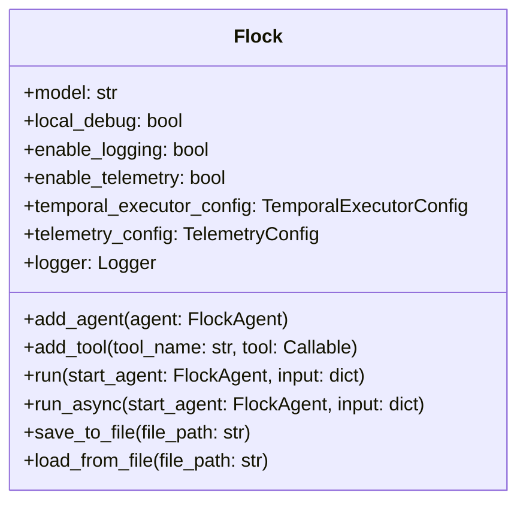

### Key Features

- **Agent Management**: Add and manage multiple agents in a single system.
- **Tool Registration**: Register tools that agents can use during execution.
- **Context Management**: Set up and maintain the global execution context.
- **Workflow Execution**: Run agent workflows either locally or via Temporal.
- **Serialization**: Save and load Flock instances to/from files.

### Important Methods

- `add_agent(agent)`: Add a new agent to the Flock system.
- `add_tool(tool_name, tool)`: Register a tool with the Flock system.
- `run(start_agent, input, ...)`: Run an agent workflow synchronously.
- `run_async(start_agent, input, ...)`: Run an agent workflow asynchronously.
- `save_to_file(file_path)`: Save the Flock instance to a file.
- `load_from_file(file_path)`: Load a Flock instance from a file.

## FlockAgent

The `FlockAgent` class is the core, declarative base class for all agents in the Flock framework. It defines the agent's inputs, outputs, tools, and lifecycle hooks.

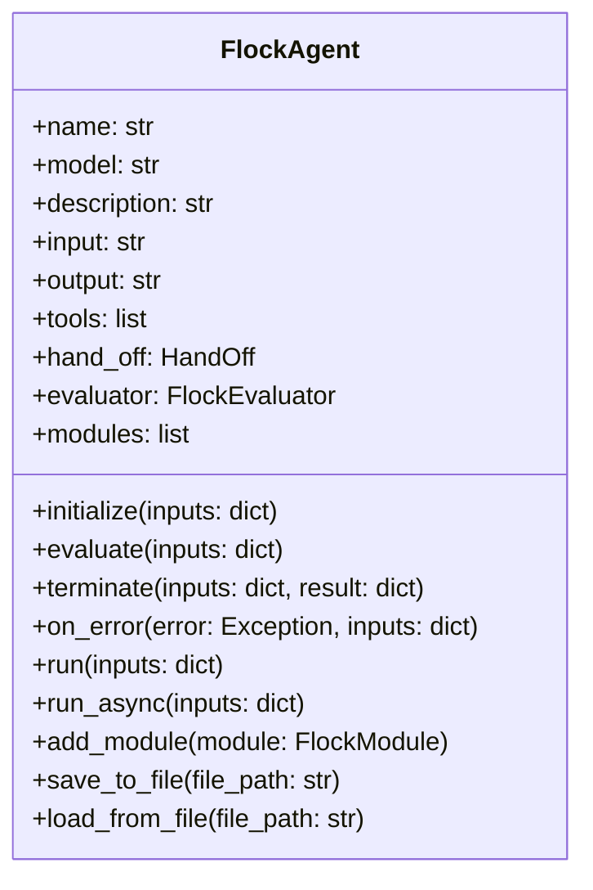

### Key Features

- **Declarative Definition**: Define agents by their inputs and outputs.
- **Type Hints**: Support for type hints and descriptions in input/output definitions.
- **Tool Integration**: Use tools to extend agent capabilities.
- **Lifecycle Hooks**: Hooks for initialization, termination, evaluation, and error handling.
- **Module Support**: Attach modules to extend agent functionality.
- **Serialization**: Save and load agent instances to/from files.

### Important Properties

- `name`: Unique identifier for the agent.
- `model`: The model to use (e.g., 'openai/gpt-4o').
- `description`: A human-readable description of the agent.
- `input`: A comma-separated list of input keys with optional type hints and descriptions.
- `output`: A comma-separated list of output keys with optional type hints and descriptions.
- `tools`: An optional list of callable tools that the agent can leverage during execution.
- `hand_off`: Specifies the next agent in the workflow or a callable that determines the handoff.
- `evaluator`: The evaluator to use for agent evaluation.
- `modules`: FlockModules attached to this agent.

### Lifecycle Hooks

- `initialize(inputs)`: Called when the agent starts running.
- `evaluate(inputs)`: Called to evaluate inputs and produce outputs.
- `terminate(inputs, result)`: Called when the agent finishes running.
- `on_error(error, inputs)`: Called when an error occurs during agent execution.

## FlockEvaluator

The `FlockEvaluator` class is the base class for all evaluators in Flock. An evaluator is responsible for taking inputs and producing outputs using some evaluation strategy.

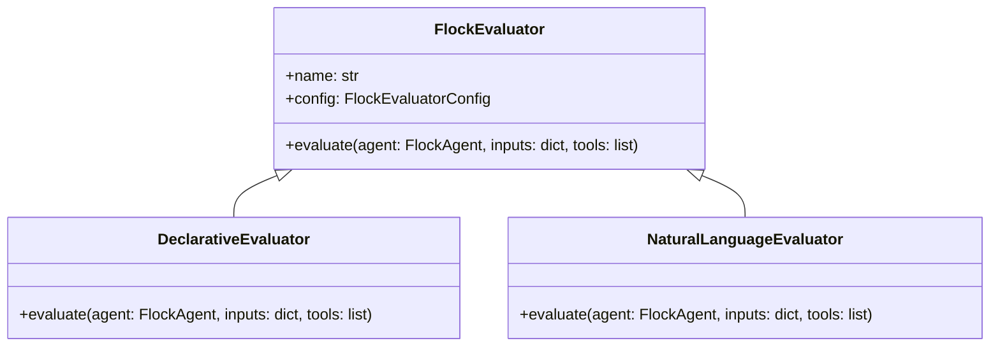

### Key Features

- **Evaluation Strategy**: Define how inputs are evaluated to produce outputs.
- **Configuration**: Configure the evaluator's behavior.
- **Abstract Interface**: Provide a common interface for different evaluation strategies.

### Important Methods

- `evaluate(agent, inputs, tools)`: Evaluate inputs to produce outputs.

### Built-in Evaluators

- **DeclarativeEvaluator**: The default evaluator that uses a declarative approach to evaluation.
- **NaturalLanguageEvaluator**: An evaluator that uses natural language for evaluation.

## FlockModule

The `FlockModule` class is the base class for all Flock modules. Modules can hook into agent lifecycle events and modify or enhance agent behavior.

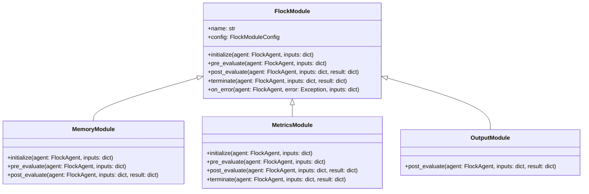

### Key Features

- **Lifecycle Hooks**: Hook into agent lifecycle events.
- **State Management**: Maintain state across agent executions.
- **Configuration**: Configure the module's behavior.
- **Pluggable**: Easily attach to and detach from agents.

### Lifecycle Hooks

- `initialize(agent, inputs)`: Called when the agent starts running.
- `pre_evaluate(agent, inputs)`: Called before agent evaluation, can modify inputs.
- `post_evaluate(agent, inputs, result)`: Called after agent evaluation, can modify results.
- `terminate(agent, inputs, result)`: Called when the agent finishes running.
- `on_error(agent, error, inputs)`: Called when an error occurs during agent execution.

### Built-in Modules

- **MemoryModule**: Provides persistent memory for agents.
- **MetricsModule**: Collects metrics about agent execution.
- **OutputModule**: Formats and stores agent outputs.

## HandOff

The `HandOff` class is used to specify the next agent in a workflow and the input data to pass to it.

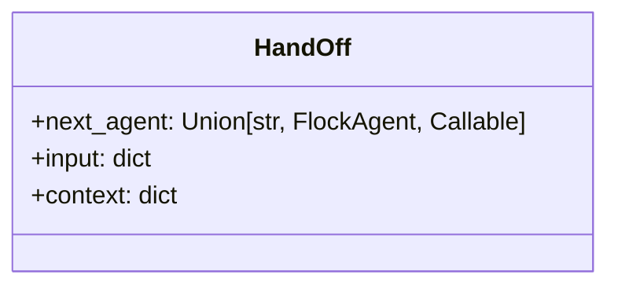

### Key Properties

- `next_agent`: The next agent to invoke (either a string name, a FlockAgent instance, or a callable that returns an agent).
- `input`: Input data for the next agent.
- `context`: Override context parameters.

## Registry

The registry manages the registration of agents and tools.

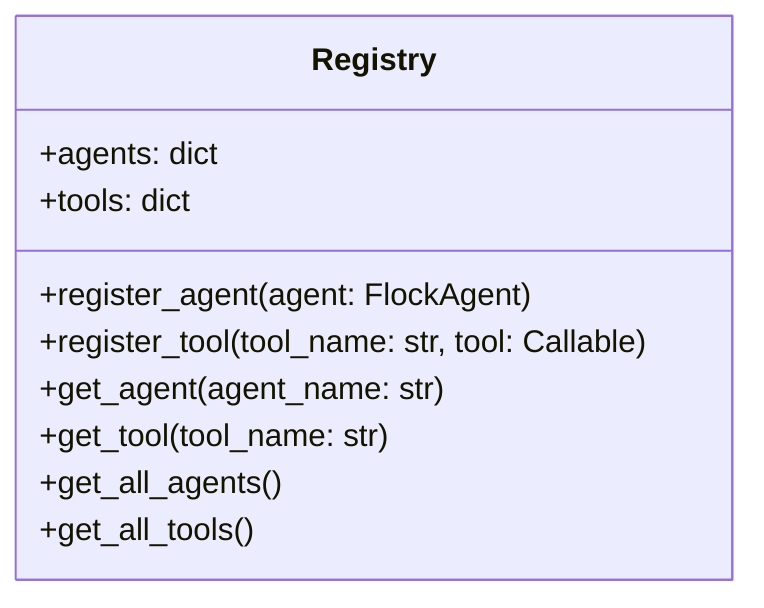

### Key Features

- **Agent Registration**: Register agents with the registry.
- **Tool Registration**: Register tools with the registry.
- **Lookup**: Look up agents and tools by name.

### Important Methods

- `register_agent(agent)`: Register an agent with the registry.
- `register_tool(tool_name, tool)`: Register a tool with the registry.
- `get_agent(agent_name)`: Get an agent by name.
- `get_tool(tool_name)`: Get a tool by name.
- `get_all_agents()`: Get all registered agents.
- `get_all_tools()`: Get all registered tools.

## Context

The context maintains the global execution state.

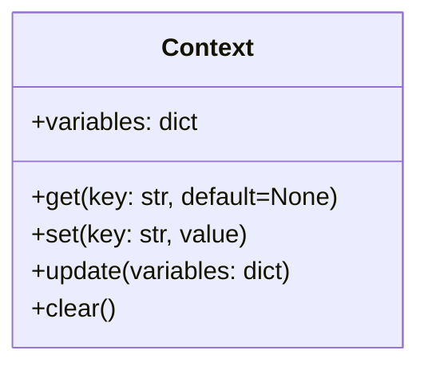

### Key Features

- **Variable Storage**: Store global variables that are accessible to all agents.
- **Variable Access**: Get and set context variables.
- **Variable Lifecycle**: Manage the lifecycle of context variables.

### Important Methods

- `get(key, default=None)`: Get a context variable.
- `set(key, value)`: Set a context variable.
- `update(variables)`: Update multiple context variables.
- `clear()`: Clear all context variables.

## Executor

The executor runs agent workflows. Flock supports two types of executors:

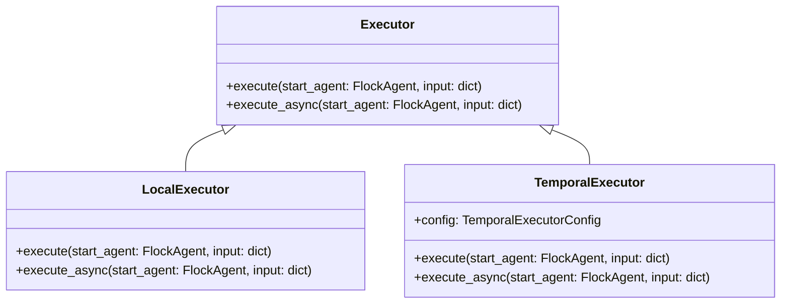

### Key Features

- **Workflow Execution**: Execute agent workflows.
- **Synchronous and Asynchronous Execution**: Support for both synchronous and asynchronous execution.
- **Error Handling**: Handle errors during workflow execution.

### Important Methods

- `execute(start_agent, input)`: Execute a workflow synchronously.
- `execute_async(start_agent, input)`: Execute a workflow asynchronously.

### Executor Types

- **LocalExecutor**: Runs workflows locally for development and testing.
- **TemporalExecutor**: Runs workflows via Temporal for production-grade execution.

## Router

The router determines the next agent in a workflow.

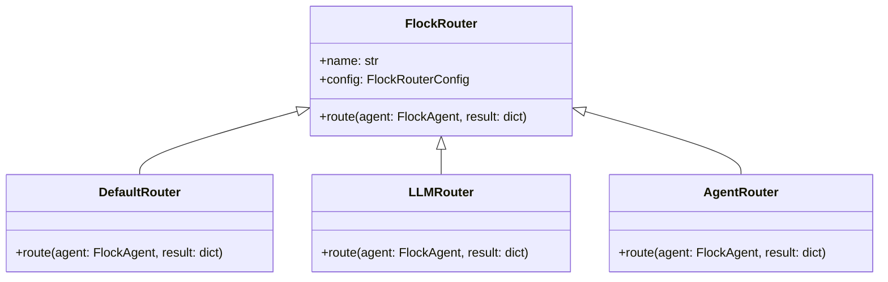

### Key Features

- **Routing Strategy**: Define how to determine the next agent in a workflow.
- **Configuration**: Configure the router's behavior.
- **Abstract Interface**: Provide a common interface for different routing strategies.

### Important Methods

- `route(agent, result)`: Determine the next agent in the workflow.

### Router Types

- **DefaultRouter**: Uses the agent's `hand_off` property to determine the next agent.
- **LLMRouter**: Uses an LLM to determine the next agent.
- **AgentRouter**: Uses a dedicated agent to make routing decisions.

## Tools

Tools are functions that agents can use to perform specific tasks.

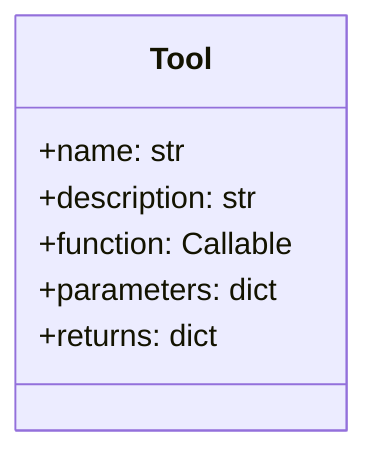

### Key Features

- **Function Wrapping**: Wrap Python functions as tools.
- **Documentation**: Provide documentation for tools.
- **Parameter Validation**: Validate tool parameters.
- **Result Formatting**: Format tool results.

### Built-in Tools

- **Web Search**: Search the web for information.
- **Code Evaluation**: Evaluate Python code.
- **Web Content Retrieval**: Get content from web pages.
- **Math Evaluation**: Evaluate mathematical expressions.
- **Utility Functions**: Various utility functions like getting the current time.

## API Server

The API server allows you to expose your agents via HTTP endpoints.

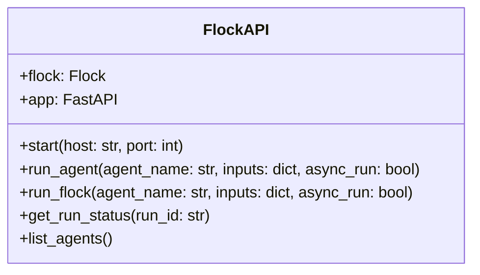

### Key Features

- **HTTP Endpoints**: Expose agents via HTTP endpoints.
- **Synchronous and Asynchronous Execution**: Support for both synchronous and asynchronous execution.
- **Run Status Tracking**: Track the status of runs.
- **Agent Discovery**: List available agents.

### Important Methods

- `start(host, port)`: Start the API server.
- `run_agent(agent_name, inputs, async_run)`: Run an agent.
- `run_flock(agent_name, inputs, async_run)`: Run a Flock workflow.
- `get_run_status(run_id)`: Get the status of a run.
- `list_agents()`: List available agents.

## Component Interactions

The following diagram shows how the components interact with each other during a typical workflow execution:

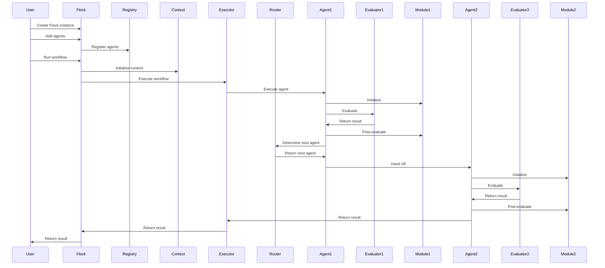

## Next Steps

Now that you understand the specific components of Flock, you might want to explore:

- [Overview](overview.md) - Get a high-level overview of the Flock architecture
- [Design Decisions](design-decisions.md) - Understand the design decisions behind Flock
- [Core Concepts](../core-concepts/agents.md) - Learn about the core concepts of Flock
- [Examples](../examples/hello-flock.md) - See examples of Flock in action
