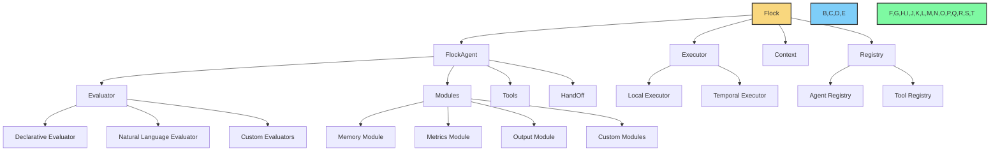
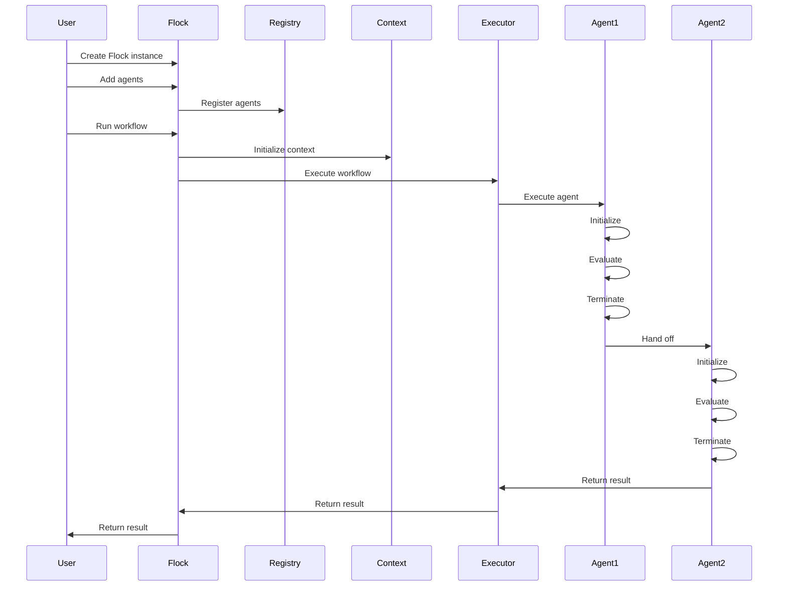

# Architecture Overview

This document provides a high-level overview of the Flock framework's architecture, explaining the key components and how they interact with each other.

## Core Architecture

Flock is designed with a modular architecture that separates concerns and allows for flexibility and extensibility. The main components are:

1. **Flock**: The main orchestrator that manages agents, tools, and workflows.
2. **FlockAgent**: The base class for all agents, defining their inputs, outputs, and behavior.
3. **Registry**: Manages the registration of agents and tools.
4. **Context**: Maintains the global execution context.
5. **Executor**: Runs agent workflows either locally or via Temporal.

## Component Relationships

### Flock

The `Flock` class is the main entry point for the framework. It:

- Manages a collection of agents
- Registers tools that agents can use
- Maintains the global context
- Orchestrates the execution of workflows

### FlockAgent

The `FlockAgent` class is the core, declarative base class for all agents. It:

- Defines the agent's inputs and outputs
- Specifies the tools the agent can use
- Defines the agent's behavior through lifecycle hooks
- Manages the agent's modules
- Specifies the next agent in the workflow (handoff)

### Registry

The registry manages the registration of agents and tools. It:

- Maintains a mapping of agent names to agent instances
- Maintains a mapping of tool names to tool functions
- Provides methods for registering and retrieving agents and tools

### Context

The context maintains the global execution state. It:

- Stores global variables that are accessible to all agents
- Provides methods for getting and setting context variables
- Manages the lifecycle of context variables

### Executor

The executor runs agent workflows. Flock supports two types of executors:

- **Local Executor**: Runs workflows locally for development and testing
- **Temporal Executor**: Runs workflows via Temporal for production-grade execution

## Execution Flow

The execution flow in Flock follows these steps:

1. **Initialization**: The Flock instance is created and agents are added.
2. **Registration**: Agents and tools are registered with the registry.
3. **Context Setup**: The global context is initialized with standardized variables.
4. **Workflow Execution**: The agent workflow is executed either locally or via Temporal.
5. **Agent Execution**: Each agent in the workflow is executed in sequence.
6. **Handoff**: Agents can hand off to other agents to continue the workflow.
7. **Termination**: The workflow terminates when the last agent completes or an error occurs.

## Evaluators

Evaluators are responsible for evaluating agent inputs to produce outputs. Flock supports different types of evaluators:

- **Declarative Evaluator**: The default evaluator that uses a declarative approach to evaluation.
- **Natural Language Evaluator**: An evaluator that uses natural language for evaluation.
- **Custom Evaluators**: You can create custom evaluators by subclassing `FlockEvaluator`.

## Modules

Modules are pluggable components that can hook into agent lifecycle events. Flock includes several built-in modules:

- **Memory Module**: Provides persistent memory for agents.
- **Metrics Module**: Collects metrics about agent execution.
- **Output Module**: Formats and stores agent outputs.
- **Custom Modules**: You can create custom modules by subclassing `FlockModule`.

## Tools

Tools are functions that agents can use to perform specific tasks. Flock includes several built-in tools:

- **Web Search**: Search the web for information.
- **Code Evaluation**: Evaluate Python code.
- **Web Content Retrieval**: Get content from web pages.
- **Math Evaluation**: Evaluate mathematical expressions.
- **Utility Functions**: Various utility functions like getting the current time.
- **Custom Tools**: You can create custom tools by defining Python functions.

## Routers

Routers determine the next agent in a workflow. Flock supports different types of routers:

- **Default Router**: Uses the agent's `hand_off` property to determine the next agent.
- **LLM Router**: Uses an LLM to determine the next agent.
- **Agent Router**: Uses a dedicated agent to make routing decisions.
- **Custom Routers**: You can create custom routers by subclassing `FlockRouter`.

## Temporal Integration

Flock integrates with Temporal for production-grade workflow execution. This provides:

- **Durability**: Persistent state management even in the case of failures.
- **Retries & Error Handling**: Automatic recovery via Temporal's built-in mechanisms.
- **Scalability**: Seamless orchestration of distributed agent workflows.

## API Server

Flock includes a REST API server that allows you to expose your agents via HTTP endpoints. This makes it easy to integrate Flock agents into web applications, microservices, or any system that can make HTTP requests.

## Design Principles

Flock is designed with the following principles in mind:

### Declarative Approach

Flock takes a declarative approach to agent definition, focusing on what agents need as input and what they produce as output, rather than requiring complex prompt engineering.

### Type Safety

Flock uses Pydantic models for type safety and clear contracts for inputs and outputs. This provides automatic JSON serialization/deserialization, strong typing, and an explicit contract for inputs and outputs.

### Lifecycle Hooks

Flock agents support lifecycle hooks such as `initialize()`, `terminate()`, `evaluate()`, and `on_error()`. This ensures that agents can perform setup, cleanup, and robust error handling—all without cluttering the main business logic.

### Fault Tolerance

Flock integrates with Temporal for fault tolerance and production readiness. This provides automatic retries, durable state management, and resilience against failures.

### Modularity

Flock is designed to be modular, with clear separation of concerns. This makes it easy to extend and customize the framework for specific use cases.

### Flexibility

Flock is designed to be flexible, allowing for a wide range of agent types and workflows. Agents can be chained together, run in parallel, or run in a batch mode.

## Next Steps

Now that you understand the high-level architecture of Flock, you might want to explore:

- [Components](components.md) - Learn more about the specific components of Flock
- [Design Decisions](design-decisions.md) - Understand the design decisions behind Flock
- [Core Concepts](../core-concepts/agents.md) - Learn about the core concepts of Flock
- [Examples](../examples/hello-flock.md) - See examples of Flock in action
