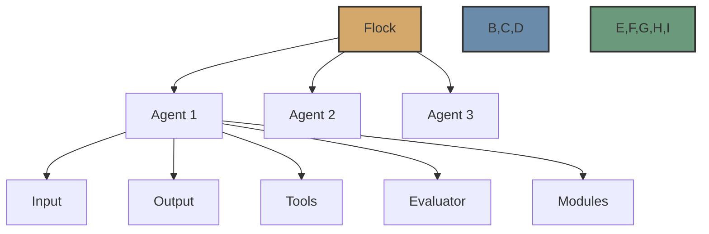

# Agents

Agents are the core building blocks of the Flock framework. They define what inputs they accept, what outputs they produce, and how they process information.



## Creating Agents

There are two main ways to create agents in Flock:

### 1. Using FlockAgent Directly

Creating a `FlockAgent` directly gives you full control over the agent configuration:

```python
from flock.core import Flock, FlockAgent
from flock.evaluators.declarative import DeclarativeEvaluator

# Create a Flock instance
flock = Flock()

# Create an agent
agent = FlockAgent(
    name="my_agent",
    input="query: str | The query to process",
    output="result: str | The processed result",
    tools=[some_tool_function],
    model="openai/gpt-4o",
    description="An agent that processes queries",
    evaluator=DeclarativeEvaluator(name="my_evaluator")
)

# Add the agent to the flock
flock.add_agent(agent)
```

### 2. Using FlockFactory

Using `FlockFactory.create_default_agent()` provides a convenient way to create pre-configured agents with common modules:

```python
from flock.core import Flock, FlockFactory
from flock.core.logging.formatters.themes import OutputTheme

# Create a Flock instance
flock = Flock()

# Create an agent using the factory
agent = FlockFactory.create_default_agent(
    name="my_agent",
    input="query: str | The query to process",
    output="result: str | The processed result",
    tools=[some_tool_function],
    model="openai/gpt-4o",
    description="An agent that processes queries",
    enable_rich_tables=True,
    output_theme=OutputTheme.aardvark_blue,
    use_cache=True
)

# Add the agent to the flock
flock.add_agent(agent)
```

The factory method automatically:
- Creates a DeclarativeEvaluator with the specified configuration
- Creates a FlockAgent with the specified parameters
- Adds an OutputModule with the specified configuration
- Adds a MetricsModule with the specified configuration

## Agent Properties

### Name

Each agent must have a unique name that identifies it within the Flock system:

```python
agent = FlockAgent(
    name="my_agent",
    # other parameters
)
```

### Input and Output

Agents define their inputs and outputs using a simple string format:

```python
agent = FlockAgent(
    name="my_agent",
    input="query: str | The query to process",
    output="result: str | The processed result",
    # other parameters
)
```

You can define multiple inputs and outputs:

```python
agent = FlockAgent(
    name="my_agent",
    input="query: str | The query to process, context: str | Additional context",
    output="result: str | The processed result, confidence: float | Confidence score",
    # other parameters
)
```

### Type Hints

You can use type hints to specify the expected types of inputs and outputs:

```python
agent = FlockAgent(
    name="my_agent",
    input="query: str | The query to process, max_results: int | Maximum number of results",
    output="results: list[str] | List of results, total_count: int | Total number of results",
    # other parameters
)
```

Supported types include:
- Basic types: `str`, `int`, `float`, `bool`
- Container types: `list`, `dict`, `tuple`
- Generic types: `list[str]`, `dict[str, int]`
- Literal types: `Literal['option1', 'option2']`
- Pydantic models

### Tools

Agents can use tools to extend their capabilities:

```python
from flock.core.tools import basic_tools

agent = FlockAgent(
    name="my_agent",
    input="query: str | The query to process",
    output="result: str | The processed result",
    tools=[basic_tools.web_search_duckduckgo, basic_tools.code_eval],
    # other parameters
)
```

### Model

You can specify which model the agent should use:

```python
agent = FlockAgent(
    name="my_agent",
    input="query: str | The query to process",
    output="result: str | The processed result",
    model="openai/gpt-4o",
    # other parameters
)
```

### Description

You can provide a description of the agent:

```python
agent = FlockAgent(
    name="my_agent",
    input="query: str | The query to process",
    output="result: str | The processed result",
    description="An agent that processes queries and returns results",
    # other parameters
)
```

### Evaluator

You can specify which evaluator the agent should use:

```python
from flock.evaluators.declarative import DeclarativeEvaluator

agent = FlockAgent(
    name="my_agent",
    input="query: str | The query to process",
    output="result: str | The processed result",
    evaluator=DeclarativeEvaluator(name="my_evaluator"),
    # other parameters
)
```

### Hand Off

You can specify which agent should be called next in a workflow:

```python
from flock.core import HandOff

agent1 = FlockAgent(
    name="agent1",
    input="query: str | The query to process",
    output="intermediate_result: str | Intermediate result",
    # other parameters
)

agent2 = FlockAgent(
    name="agent2",
    input="intermediate_result: str | Intermediate result",
    output="final_result: str | Final result",
    # other parameters
)

# Set up handoff
agent1.hand_off = HandOff(
    next_agent=agent2,
    input={"additional_data": "some value"}
)

# Or simply
agent1.hand_off = agent2
```

## Modules

You can attach modules to agents to extend their functionality:

```python
from flock.modules.memory import MemoryModule, MemoryModuleConfig
from flock.modules.output import OutputModule, OutputModuleConfig

# Create modules
memory_module = MemoryModule(
    name="memory",
    config=MemoryModuleConfig(
        file_path="memory.json",
        save_after_update=True
    )
)

output_module = OutputModule(
    name="output",
    config=OutputModuleConfig(
        theme=OutputTheme.afterglow,
        render_table=True
    )
)

# Attach modules to the agent
agent.add_module(memory_module)
agent.add_module(output_module)
```

## Running Agents

You can run agents directly:

```python
result = agent.run({"query": "Hello, world!"})
```

Or through the Flock instance:

```python
result = flock.run(
    start_agent=agent,
    input={"query": "Hello, world!"}
)
```

## Lifecycle Hooks

Agents support lifecycle hooks that allow you to customize their behavior:

```python
class MyCustomAgent(FlockAgent):
    async def initialize(self, inputs):
        """Called when the agent starts running."""
        print(f"Initializing with inputs: {inputs}")
        
    async def evaluate(self, inputs):
        """Called to evaluate inputs and produce outputs."""
        return {"result": f"Processed: {inputs['query']}"}
        
    async def terminate(self, inputs, result):
        """Called when the agent finishes running."""
        print(f"Terminating with result: {result}")
        
    async def on_error(self, error, inputs):
        """Called when an error occurs during agent execution."""
        print(f"Error: {error}")
```

## Example: Creating a Web Search Agent

```python
from flock.core import Flock, FlockFactory
from flock.core.tools import basic_tools
from flock.core.logging.formatters.themes import OutputTheme

# Create a Flock instance
flock = Flock()

# Create a web search agent
web_search_agent = FlockFactory.create_default_agent(
    name="web_search_agent",
    input="query: str | The search query",
    output="results: list[str] | The search results, summary: str | Summary of the results",
    tools=[basic_tools.web_search_duckduckgo, basic_tools.get_web_content_as_markdown],
    enable_rich_tables=True,
    output_theme=OutputTheme.aardvark_blue
)

# Add the agent to the flock
flock.add_agent(web_search_agent)

# Run the agent
result = flock.run(
    start_agent=web_search_agent,
    input={"query": "What is the capital of France?"}
)

print(result.summary)
```

## Example: Creating a Multi-Agent Workflow

```python
from flock.core import Flock, FlockFactory, HandOff
from flock.core.tools import basic_tools
from flock.core.logging.formatters.themes import OutputTheme

# Create a Flock instance
flock = Flock()

# Create a web search agent
web_search_agent = FlockFactory.create_default_agent(
    name="web_search_agent",
    input="query: str | The search query",
    output="search_results: list[str] | The search results",
    tools=[basic_tools.web_search_duckduckgo]
)

# Create a summarization agent
summarization_agent = FlockFactory.create_default_agent(
    name="summarization_agent",
    input="search_results: list[str] | The search results",
    output="summary: str | Summary of the results",
    enable_rich_tables=True,
    output_theme=OutputTheme.dracula
)

# Set up handoff
web_search_agent.hand_off = summarization_agent

# Add the agents to the flock
flock.add_agent(web_search_agent)
flock.add_agent(summarization_agent)

# Run the workflow
result = flock.run(
    start_agent=web_search_agent,
    input={"query": "What is the capital of France?"}
)

print(result.summary)
```

## Next Steps

Now that you understand agents, you might want to explore:

- [Evaluators](evaluators.md) - Learn about the different evaluators available
- [Modules](modules.md) - Learn about the module system
- [Routers](routers.md) - Learn about the routing system
- [Workflows](workflows.md) - Learn about workflow execution
