# Declarative Programming

Flock takes a declarative approach to agent development, focusing on what agents need as input and what they produce as output, rather than requiring complex prompt engineering to specify how they should operate.

```mermaid
graph TD
    subgraph "Traditional Approach"
        A1[Define Prompt] --> B1[Specify How]
        B1 --> C1[Manage Context]
        C1 --> D1[Handle Edge Cases]
        D1 --> E1[Prompt Engineering]
    end
    
    subgraph "Declarative Approach"
        A2[Define Inputs] --> B2[Define Outputs]
        B2 --> C2[Let LLM Figure Out How]
        C2 --> D2[Focus on What, Not How]
    end
    
    style A1,B1,C1,D1,E1 fill:#aa6a6a,stroke:#333,stroke-width:2px
    style A2,B2,C2,D2 fill:#6a9a7b,stroke:#333,stroke-width:2px
```



## What is Declarative Programming?

Declarative programming is a programming paradigm that expresses the logic of a computation without describing its control flow. In other words, you specify what you want to achieve, not how to achieve it.

In the context of Flock, this means:

1. You define what inputs your agent needs
2. You define what outputs your agent should produce
3. Flock handles the rest, including prompt generation, context management, and error handling

This approach is in contrast to the traditional imperative approach, where you would need to write detailed prompts that specify exactly how the agent should operate.

## The Declarative Advantage

The declarative approach offers several advantages:

### 1. Simplicity

```python
# Traditional approach (simplified)
prompt = """
You are an expert blog writer. Given a topic, generate a catchy title and 5-7 section headers for a blog post.
The title should be attention-grabbing and use wordplay if possible.
The section headers should be organized logically and cover the main aspects of the topic.
Each section header should be concise but descriptive.

Topic: {topic}

Output format:
Title: <title>
Headers:
1. <header 1>
2. <header 2>
...
"""

# Declarative approach
agent = FlockAgent(
    name="bloggy",
    input="topic: str | The blog topic",
    output="""
        title: str | A catchy blog title
        headers: list[str] | 5-7 section headers
    """
)
```

### 2. Maintainability

With the declarative approach, you don't need to maintain complex prompts. If you want to change the behavior of your agent, you can simply update its input and output definitions.

### 3. Composability

Declarative agents are easier to compose into workflows. Since the inputs and outputs are clearly defined, it's easier to chain agents together.

```python
# First agent: Generate titles and headers
bloggy = FlockAgent(
    name="bloggy",
    input="topic: str | The blog topic",
    output="""
        title: str | A catchy blog title
        headers: list[str] | 5-7 section headers
    """
)

# Second agent: Generate content for headers
content_writer = FlockAgent(
    name="content_writer",
    input="""
        title: str | The blog title
        headers: list[str] | The section headers
    """,
    output="content: str | The full blog content"
)

# Chain them together
bloggy.hand_off = content_writer
```

### 4. Type Safety

The declarative approach allows for strong typing of inputs and outputs, which provides better validation and error messages.

```python
agent = FlockAgent(
    name="calculator",
    input="""
        operation: str | The operation to perform (add, subtract, multiply, divide)
        a: int | The first number
        b: int | The second number
    """,
    output="result: float | The result of the operation"
)
```

### 5. Documentation

The declarative approach provides built-in documentation for your agents. The input and output definitions serve as documentation for what the agent does.

## How Flock Implements Declarative Programming

Flock implements declarative programming through several key components:

### 1. Agent Definition

Agents are defined by their inputs and outputs, not by prompts.

```python
agent = FlockAgent(
    name="my_agent",
    input="query: str | The query to process",
    output="result: str | The processed result"
)
```

### 2. Type System

Flock's type system allows for strong typing of inputs and outputs, which provides better validation and error messages.

```python
agent = FlockAgent(
    name="calculator",
    input="""
        operation: str | The operation to perform (add, subtract, multiply, divide)
        a: int | The first number
        b: int | The second number
    """,
    output="result: float | The result of the operation"
)
```

### 3. Evaluators

Evaluators are responsible for taking inputs and producing outputs using some evaluation strategy. The default evaluator in Flock is the `DeclarativeEvaluator`, which takes a declarative approach to evaluation.

```python
from flock.evaluators.declarative.declarative_evaluator import DeclarativeEvaluator

evaluator = DeclarativeEvaluator(name="declarative_evaluator")
agent.evaluator = evaluator
```

### 4. Modules

Modules can hook into agent lifecycle events and modify or enhance agent behavior. This allows for extending agent functionality without modifying the agent's core logic.

```python
from flock.modules.memory import MemoryModule

memory_module = MemoryModule(name="memory")
agent.add_module(memory_module)
```

## Declarative vs. Imperative

Let's compare the declarative approach with the traditional imperative approach:

### Imperative Approach

```python
# Define a prompt
prompt = """
You are an expert blog writer. Given a topic, generate a catchy title and 5-7 section headers for a blog post.
The title should be attention-grabbing and use wordplay if possible.
The section headers should be organized logically and cover the main aspects of the topic.
Each section header should be concise but descriptive.

Topic: {topic}

Output format:
Title: <title>
Headers:
1. <header 1>
2. <header 2>
...
"""

# Use the prompt
def generate_blog(topic):
    response = llm(prompt.format(topic=topic))
    # Parse the response
    lines = response.strip().split("\n")
    title = lines[0].replace("Title: ", "")
    headers = [line.split(". ")[1] for line in lines[2:] if line.strip()]
    return {"title": title, "headers": headers}
```

### Declarative Approach

```python
# Define an agent
agent = FlockAgent(
    name="bloggy",
    input="topic: str | The blog topic",
    output="""
        title: str | A catchy blog title
        headers: list[str] | 5-7 section headers
    """
)

# Use the agent
result = agent.run({"topic": "Artificial Intelligence"})
# result = {"title": "...", "headers": [...]}
```

## Best Practices

When using Flock's declarative approach, consider the following best practices:

1. **Be Clear and Specific**: Clearly define what inputs your agent needs and what outputs it should produce.
2. **Use Type Hints**: Add type hints to your input and output definitions to provide better validation and error messages.
3. **Add Descriptions**: Include descriptions for all inputs and outputs to provide better documentation.
4. **Keep It Simple**: Focus on what your agent needs to do, not how it should do it.
5. **Compose Agents**: Break down complex tasks into smaller, more focused agents that can be composed into workflows.

## Next Steps

Now that you understand Flock's declarative approach, you might want to explore:

- [Agents](agents.md) - Learn more about Flock agents
- [Type System](type-system.md) - Explore Flock's type system
- [Evaluators](evaluators.md) - Understand how evaluators work
- [Modules](modules.md) - Learn about Flock's module system
- [Workflows](workflows.md) - Understand how to compose agents into workflows
