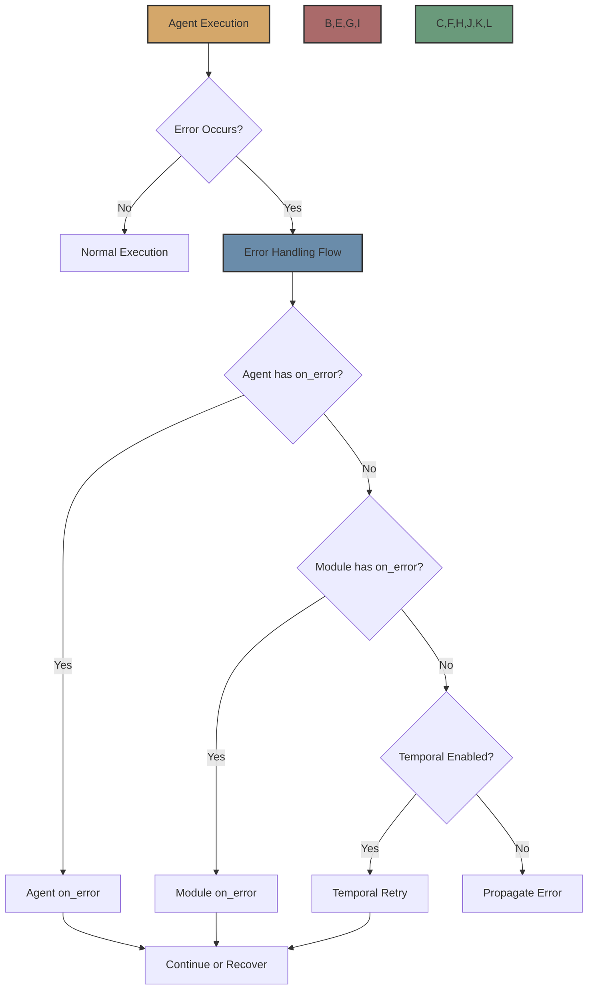

# Error Handling

Flock provides a comprehensive error handling system that allows you to gracefully handle errors at different levels of your agent workflows. This ensures that your applications remain robust and can recover from unexpected situations.



## Error Handling Levels

Flock provides error handling at multiple levels:

1. **Agent Level**: Agents can implement the `on_error` method to handle errors that occur during their execution.
2. **Module Level**: Modules can implement the `on_error` method to handle errors that occur during agent execution.
3. **Workflow Level**: When using Temporal, workflows can be configured to automatically retry failed activities.
4. **Global Level**: Errors that are not handled at the agent, module, or workflow level are propagated to the caller.

## Agent-Level Error Handling

Agents can implement the `on_error` method to handle errors that occur during their execution:

```python
class MyAgent(FlockAgent):
    async def on_error(self, error, inputs):
        """Called when an error occurs during agent execution."""
        print(f"Error: {error}")
        # Return a fallback result
        return {"result": "Fallback result due to error"}
```

The `on_error` method receives the error and the inputs that were passed to the agent. It can return a fallback result that will be used as the agent's output.

## Module-Level Error Handling

Modules can implement the `on_error` method to handle errors that occur during agent execution:

```python
class MyModule(FlockModule):
    async def on_error(self, agent, error, inputs):
        """Called when an error occurs during agent execution."""
        print(f"Module error handler: {error}")
        # Log the error
        self.log_error(error, inputs)
        # Return the inputs unchanged
        return inputs
```

The `on_error` method receives the agent, the error, and the inputs that were passed to the agent. It can modify the inputs and return them, which will be passed to the next module's `on_error` method or to the agent's `on_error` method if no more modules have an `on_error` method.

## Workflow-Level Error Handling

When using Temporal, workflows can be configured to automatically retry failed activities:

```python
from flock.core import Flock
from flock.core.execution.temporal_executor import TemporalExecutorConfig

# Create a Flock instance with Temporal enabled
flock = Flock(
    model="openai/gpt-4o",
    local_debug=False,  # Enable Temporal
    temporal_executor_config=TemporalExecutorConfig(
        retry_attempts=3,  # Retry failed activities 3 times
        retry_interval=5,  # Wait 5 seconds between retries
    )
)
```

Temporal provides several retry options:

- **retry_attempts**: The maximum number of retry attempts
- **retry_interval**: The initial interval between retries (in seconds)
- **retry_max_interval**: The maximum interval between retries (in seconds)
- **retry_coefficient**: The coefficient to multiply the interval by after each retry

## Global-Level Error Handling

Errors that are not handled at the agent, module, or workflow level are propagated to the caller:

```python
try:
    result = flock.run(
        start_agent=agent,
        input={"query": "Hello, world!"}
    )
except Exception as e:
    print(f"Error: {e}")
    # Handle the error at the global level
```

## Error Types

Flock defines several error types:

### FlockError

The base class for all Flock errors:

```python
from flock.core.errors import FlockError

try:
    result = flock.run(
        start_agent=agent,
        input={"query": "Hello, world!"}
    )
except FlockError as e:
    print(f"Flock error: {e}")
```

### AgentError

Raised when an error occurs during agent execution:

```python
from flock.core.errors import AgentError

try:
    result = flock.run(
        start_agent=agent,
        input={"query": "Hello, world!"}
    )
except AgentError as e:
    print(f"Agent error: {e}")
    print(f"Agent name: {e.agent_name}")
    print(f"Inputs: {e.inputs}")
```

### EvaluatorError

Raised when an error occurs during evaluator execution:

```python
from flock.core.errors import EvaluatorError

try:
    result = flock.run(
        start_agent=agent,
        input={"query": "Hello, world!"}
    )
except EvaluatorError as e:
    print(f"Evaluator error: {e}")
    print(f"Evaluator name: {e.evaluator_name}")
```

### ModuleError

Raised when an error occurs during module execution:

```python
from flock.core.errors import ModuleError

try:
    result = flock.run(
        start_agent=agent,
        input={"query": "Hello, world!"}
    )
except ModuleError as e:
    print(f"Module error: {e}")
    print(f"Module name: {e.module_name}")
    print(f"Method: {e.method}")
```

### ValidationError

Raised when input or output validation fails:

```python
from flock.core.errors import ValidationError

try:
    result = flock.run(
        start_agent=agent,
        input={"query": 123}  # Should be a string
    )
except ValidationError as e:
    print(f"Validation error: {e}")
    print(f"Field: {e.field}")
    print(f"Value: {e.value}")
    print(f"Expected type: {e.expected_type}")
```

## Best Practices

When implementing error handling in Flock, consider the following best practices:

### 1. Handle Errors at the Appropriate Level

Choose the appropriate level for error handling based on the error type and the desired behavior:

- **Agent Level**: For errors that are specific to the agent and can be handled by the agent
- **Module Level**: For errors that are related to the module's functionality
- **Workflow Level**: For transient errors that can be resolved by retrying
- **Global Level**: For errors that cannot be handled at lower levels

### 2. Provide Fallback Behavior

When handling errors, provide fallback behavior that allows the workflow to continue:

```python
class MyAgent(FlockAgent):
    async def on_error(self, error, inputs):
        """Called when an error occurs during agent execution."""
        print(f"Error: {error}")
        # Return a fallback result
        return {"result": "Fallback result due to error"}
```

### 3. Log Errors

Log errors to help with debugging and monitoring:

```python
class MyModule(FlockModule):
    async def on_error(self, agent, error, inputs):
        """Called when an error occurs during agent execution."""
        print(f"Module error handler: {error}")
        # Log the error
        self.log_error(error, inputs)
        # Return the inputs unchanged
        return inputs
```

### 4. Use Temporal for Production

For production deployments, use Temporal to provide robust error handling and automatic retries:

```python
flock = Flock(
    model="openai/gpt-4o",
    local_debug=False,  # Enable Temporal
    temporal_executor_config=TemporalExecutorConfig(
        retry_attempts=3,  # Retry failed activities 3 times
        retry_interval=5,  # Wait 5 seconds between retries
    )
)
```

### 5. Validate Inputs and Outputs

Use Flock's type system to validate inputs and outputs and catch errors early:

```python
agent = FlockAgent(
    name="calculator",
    input="""
        operation: str | The operation to perform (add, subtract, multiply, divide)
        a: int | The first number
        b: int | The second number
    """,
    output="result: float | The result of the operation"
)
```

## Example: Comprehensive Error Handling

Here's an example of comprehensive error handling in Flock:

```python
from flock.core import Flock, FlockAgent, FlockModule
from flock.core.execution.temporal_executor import TemporalExecutorConfig
from flock.core.errors import FlockError

# Define a module with error handling
class LoggingModule(FlockModule):
    async def on_error(self, agent, error, inputs):
        """Called when an error occurs during agent execution."""
        print(f"Module error handler: {error}")
        # Log the error
        self.log_error(error, inputs)
        # Return the inputs unchanged
        return inputs

# Define an agent with error handling
class MyAgent(FlockAgent):
    async def on_error(self, error, inputs):
        """Called when an error occurs during agent execution."""
        print(f"Agent error handler: {error}")
        # Return a fallback result
        return {"result": "Fallback result due to error"}

# Create a Flock instance with Temporal enabled
flock = Flock(
    model="openai/gpt-4o",
    local_debug=False,  # Enable Temporal
    temporal_executor_config=TemporalExecutorConfig(
        retry_attempts=3,  # Retry failed activities 3 times
        retry_interval=5,  # Wait 5 seconds between retries
    )
)

# Create an agent
agent = MyAgent(
    name="my_agent",
    input="query: str | The query to process",
    output="result: str | The processed result"
)

# Add the module to the agent
module = LoggingModule(name="logging_module")
agent.add_module(module)

# Add the agent to the flock
flock.add_agent(agent)

# Run the agent with global error handling
try:
    result = flock.run(
        start_agent=agent,
        input={"query": "Hello, world!"}
    )
    print(f"Result: {result}")
except FlockError as e:
    print(f"Flock error: {e}")
    # Handle the error at the global level
except Exception as e:
    print(f"Unexpected error: {e}")
    # Handle unexpected errors
```

## Next Steps

Now that you understand error handling in Flock, you might want to explore:

- [Agents](agents.md) - Learn more about Flock agents
- [Modules](modules.md) - Explore Flock's module system
- [Workflows](workflows.md) - Understand how to compose agents into workflows
- [Temporal Integration](../integrations/temporal.md) - Learn about Temporal integration
- [Error Recovery](../tutorials/error-recovery.md) - See examples of error recovery in action
