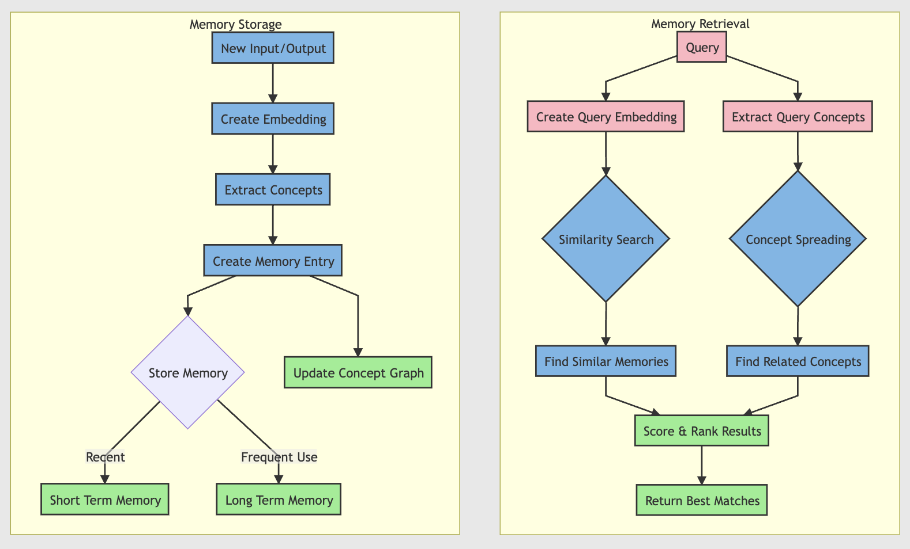
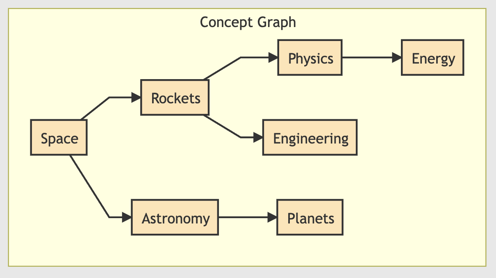
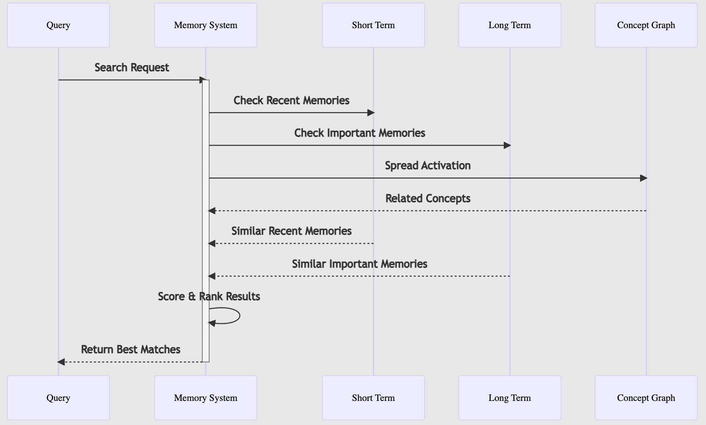

# Flock Memory System: How It Works

Ever wondered how AI can remember and learn from past interactions? Flock's memory system works a lot like human memory, but with some cool technical tricks! Let's break it down.

## 🧠 The Big Picture

Imagine you're organizing a huge library of experiences. This library has:

- Recent memories (short-term)
- Important, well-used memories (long-term)
- Connections between related topics
- A smart way to find relevant information

That's basically what Flock's memory system does!


## 💭 How Memories Are Stored

### 1. Memory Entries

Each memory is stored with:

- What went in (inputs)
- What came out (outputs)
- When it happened (timestamp)
- How often it's used (access count)
- Special "embedding" (think of it as the memory's fingerprint)
- Related concepts (like tags or keywords)

```python
memory = {
    "inputs": {"question": "How do rockets work?"},
    "outputs": {"answer": "Rockets work by..."},
    "timestamp": "2025-02-20",
    "access_count": 3,
    "concepts": ["rockets", "space", "physics"]
}
```

### 2. Smart Fingerprinting (Embeddings)

- Every memory gets a special "fingerprint" (a list of numbers)
- Similar memories have similar fingerprints
- This helps find related memories quickly
- Uses a smart AI model (Sentence Transformers) to create these fingerprints

{ width="600" }

### 3. Concept Graph

- Maintains a network of connected concepts
- Like how your brain connects "rocket" with "space" and "physics"
- The more often concepts appear together, the stronger their connection
- Helps find related memories even if they use different words


{ width="600" }

## 🔍 How Memories Are Retrieved

{ width="600" }

### 1. Similarity Search

When looking for memories, the system:

1. Creates a fingerprint of your query
2. Compares it with stored memory fingerprints
3. Finds the closest matches

Like finding books in a library by topic, not just exact title matches!

### 2. Memory Scoring

Each memory gets a score based on:

```
Final Score = Similarity × Decay × Reinforcement × Decay Factor

Where:

- Similarity: How well it matches your query (0-1)
- Decay: Newer memories score higher
- Reinforcement: Frequently used memories score higher
- Decay Factor: Adjusts based on usefulness
```

### 3. Memory Evolution

Memories change over time:

- Frequently used memories get stronger (higher decay factor)
- Unused memories fade (lower decay factor)
- Very frequently used memories move to long-term storage
- Just like how human memories work!

## 🎯 Memory Operations

You can interact with memory in different ways:

### 1. Semantic Search

```python
"topic -> memory.semantic(threshold=0.8)"
# Finds memories that are conceptually similar
```

### 2. Exact Match

```python
"topic -> memory.exact"
# Finds memories that match precisely
```

### 3. Combined Search

```python
"topic -> memory.semantic | memory.exact | memory.combine"
# Uses both similarity and exact matching
```

## 🌟 Cool Features

### 1. Clustering

- Similar memories are grouped together
- Makes retrieval faster
- Helps identify patterns in the knowledge

### 2. Spreading Activation

- When finding related concepts, activation "spreads" through the concept network
- Like how thinking about "rockets" might lead to "space travel" then "astronauts"
- Helps discover relevant but not obvious connections

### 3. Automatic Promotion

- Frequently used memories automatically move to long-term storage
- Like how you remember important things better than one-off events
- Helps maintain a balance between fresh and important memories

## 📈 Memory Over Time

As the system is used:

1. Short-term memory collects recent interactions
2. Important memories move to long-term storage
3. The concept graph grows and strengthens connections
4. Clustering helps organize growing knowledge
5. Search becomes smarter with more context

## 🔧 Under The Hood Example

Let's say you ask about rockets:

1. **Storage**
   ```python
   Entry(
       id="mem_123",
       inputs={"query": "How do rockets work?"},
       embedding=[0.1, 0.2, ...],  # Fingerprint
       concepts={"rockets", "physics", "space"}
   )
   ```

2. **Retrieval**
   ```python
   # When you ask about "space travel":
   query_embedding = compute_embedding("space travel")
   similar_memories = find_similar(query_embedding)
   concept_memories = spread_activation({"space", "travel"})
   results = combine_and_rank(similar_memories, concept_memories)
   ```

3. **Learning**
   ```python
   # After using a memory:
   memory.access_count += 1
   memory.decay_factor *= 1.1  # Gets stronger
   if memory.access_count > 10:
       promote_to_long_term(memory)
   ```

## 🎓 Why This Matters

This system gives Flock:

1. Better context awareness
2. More consistent responses
3. Learning from interactions
4. Efficient knowledge retrieval
5. Natural knowledge evolution

Just like a human assistant would remember past conversations and learn from experience!


In addition to the memory there is a declarative memory mapping system in which you define what memory you want to extract. Let's look at it!


## 🗺️ Memory Mapping System

## 🔗 Basic Syntax

Memory mappings use this pattern:
```python
"input -> operation1 | operation2 | operation3 -> output"
```
Where:
- `->` points to where data should flow
- `|` chains operations together (like pipes in Unix)
- Operations can have parameters in parentheses

## 🧪 Available Operations

### 1. Semantic Search
```python
"query -> memory.semantic(threshold=0.8)"
```
Parameters:
- `threshold`: Similarity cutoff (0-1)
- `max_results`: Maximum number of results
- `scope`: 'local', 'global', or 'both'

### 2. Exact Match
```python
"topic -> memory.exact"
```
Looks for exact matches in memory entries. Good for when you need precise matching.

### 3. Filter
```python
"memory.filter(recency='7d', relevance=0.5)"
```
Parameters:
- `recency`: Time window ('24h', '7d', etc.)
- `relevance`: Minimum relevance score
- `metadata`: Custom metadata filters

### 4. Sort
```python
"memory.sort(by='relevance', ascending=False)"
```
Parameters:
- `by`: 'relevance', 'recency', or 'access_count'
- `ascending`: Sort direction

### 5. Combine
```python
"memory.combine(weights={'semantic': 0.7, 'exact': 0.3})"
```
Merges results from different operations.

## Examples

### Simple Query
```python
"topic -> memory.semantic(threshold=0.8) -> result"
```
Just finds semantically similar memories.

### Complex Research
```python
memory_mapping = """
    topic -> memory.semantic(threshold=0.9) |
    memory.filter(recency='7d') |
    memory.sort(by='relevance')
    -> research_results
"""
```
Finds recent, highly relevant memories.

### Multi-path Search
```python
memory_mapping = """
    topic -> memory.semantic(threshold=0.8) |
    style -> memory.exact |
    memory.combine(weights={'semantic': 0.6, 'exact': 0.4}) |
    memory.filter(recency='24h')
    -> final_results
"""
```
This:
1. Does semantic search on topic
2. Does exact match on style
3. Combines both results with weights
4. Filters to last 24 hours

### Real-world Example
```python
researcher = FlockAgent(
    name="researcher",
    input="query: str | Research query",
    output="findings: str | Research findings",
    memory_mapping="""
        query -> memory.semantic(threshold=0.9, scope='global') |
        memory.filter(recency='7d') |
        memory.enrich(tools=['web_search']) |
        memory.sort(by='relevance') |
        memory.combine
        -> findings
    """
)
```

## How It Works Internally

1. **Parsing**:
   ```python
   mapping = "topic -> memory.semantic(0.8) | memory.filter(recency='7d')"
   # Gets parsed into:
   operations = [
       SemanticOperation(threshold=0.8),
       FilterOperation(recency='7d')
   ]
   ```

2. **Execution**:
   - Each operation is executed in sequence
   - Results flow from one operation to the next
   - Final results are returned

3. **Error Handling**:
   - Invalid operations are caught during parsing
   - Runtime errors are caught during execution
   - Clear error messages help debugging

## Tips for Writing Mappings

1. **Start Simple**
   ```python
   "query -> memory.semantic -> result"
   ```

2. **Add Refinements**
   ```python
   "query -> memory.semantic | memory.filter -> result"
   ```

3. **Fine-tune Parameters**
   ```python
   "query -> memory.semantic(threshold=0.9) | memory.filter(recency='7d') -> result"
   ```

4. **Complex Flows**
   ```python
   """
   query -> memory.semantic |
   memory.filter |
   memory.sort |
   memory.combine
   -> result
   """
   ```
