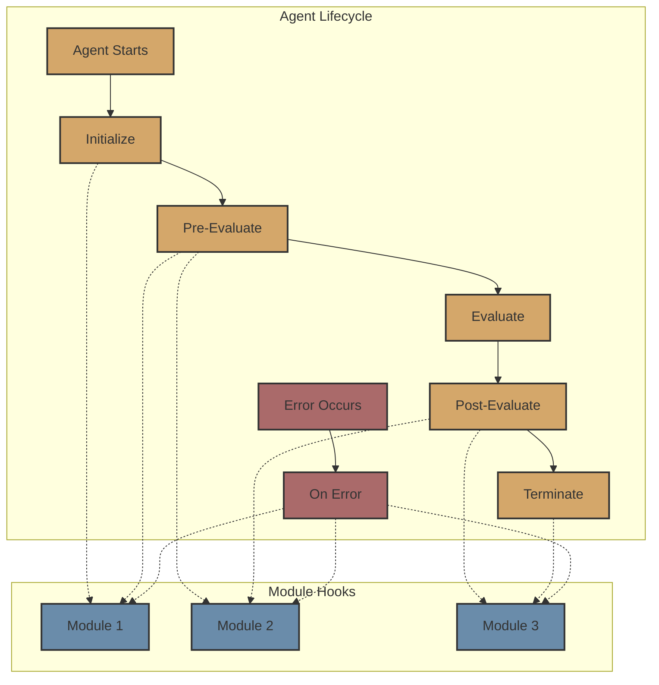

# Modules

Modules are pluggable components in the Flock framework that can hook into agent lifecycle events and modify or enhance agent behavior. They provide a way to extend agent functionality without modifying the agent's core logic.



## What are Modules?

In Flock, a module is a component that can:

1. Hook into agent lifecycle events
2. Maintain state across agent executions
3. Modify inputs and outputs
4. Add new capabilities to agents

Modules follow a similar pattern to middleware in web frameworks like FastAPI, allowing you to add cross-cutting concerns such as logging, monitoring, memory, and more.

## Module Architecture

All modules inherit from the `FlockModule` base class, which defines the interface that all modules must implement:

```python
class FlockModule(BaseModel, ABC):
    """Base class for all modules.

    A module is a component that can hook into agent lifecycle events
    and modify or enhance agent behavior.
    """

    name: str = Field(..., description="Name of the module")
    config: FlockModuleConfig = Field(default_factory=FlockModuleConfig)

    async def initialize(
        self,
        agent: FlockAgent,
        inputs: dict[str, Any],
    ) -> dict[str, Any]:
        """Called when the agent starts running."""
        return inputs

    async def pre_evaluate(
        self,
        agent: FlockAgent,
        inputs: dict[str, Any],
    ) -> dict[str, Any]:
        """Called before agent evaluation, can modify inputs."""
        return inputs

    async def post_evaluate(
        self,
        agent: FlockAgent,
        inputs: dict[str, Any],
        result: dict[str, Any],
    ) -> dict[str, Any]:
        """Called after agent evaluation, can modify results."""
        return result

    async def terminate(
        self,
        agent: FlockAgent,
        inputs: dict[str, Any],
        result: dict[str, Any],
    ) -> dict[str, Any]:
        """Called when the agent finishes running."""
        return result

    async def on_error(
        self,
        agent: FlockAgent,
        error: Exception,
        inputs: dict[str, Any],
    ) -> dict[str, Any]:
        """Called when an error occurs during agent execution."""
        return inputs
```

## Built-in Modules

Flock provides several built-in modules:

### Memory Module

The `MemoryModule` provides persistent memory capabilities to agents, allowing them to remember and learn from past interactions.

```python
from flock.modules.memory import MemoryModule, MemoryModuleConfig

memory_module = MemoryModule(
    name="memory",
    config=MemoryModuleConfig(
        file_path="memory.json",
        save_after_update=True,
        max_short_term=100,
        max_long_term=1000,
    )
)
```

### Output Module

The `OutputModule` provides advanced output formatting and storage capabilities.

```python
from flock.modules.output import OutputModule, OutputModuleConfig

output_module = OutputModule(
    name="output",
    config=OutputModuleConfig(
        output_dir="outputs",
        format="json",
    )
)
```

### Metrics Module

The `MetricsModule` provides detailed performance tracking for agents.

```python
from flock.modules.metrics import MetricsModule, MetricsModuleConfig

metrics_module = MetricsModule(
    name="metrics",
    config=MetricsModuleConfig(
        metrics_dir="metrics",
        track_execution_time=True,
        track_token_usage=True,
    )
)
```

### Zep Module

The `ZepModule` integrates with the Zep knowledge graph system, allowing agents to add or query data from a knowledge graph.

```python
from flock.modules.zep import ZepModule, ZepModuleConfig

zep_module = ZepModule(
    name="zep",
    config=ZepModuleConfig(
        zep_api_url="https://api.zep.us",
        zep_api_key="your-api-key",
    )
)
```

## Using Modules

To use a module with an agent, simply add it to the agent using the `add_module` method:

```python
from flock.core import Flock, FlockAgent
from flock.modules.memory import MemoryModule, MemoryModuleConfig

# Create a Flock instance
flock = Flock(model="openai/gpt-4o")

# Create an agent
agent = FlockAgent(
    name="my_agent",
    input="query: str | The query to process",
    output="result: str | The processed result",
)

# Create and add a memory module
memory_module = MemoryModule(
    name="memory",
    config=MemoryModuleConfig(
        file_path="memory.json",
        save_after_update=True,
    )
)
agent.add_module(memory_module)

# Add the agent to the flock
flock.add_agent(agent)
```

When using `FlockFactory`, you can specify the modules as a parameter:

```python
from flock.core import Flock, FlockFactory
from flock.modules.memory import MemoryModule, MemoryModuleConfig

# Create a Flock instance
flock = Flock(model="openai/gpt-4o")

# Create an agent with a memory module
agent = FlockFactory.create_default_agent(
    name="my_agent",
    input="query: str | The query to process",
    output="result: str | The processed result",
    modules=[
        MemoryModule(
            name="memory",
            config=MemoryModuleConfig(
                file_path="memory.json",
                save_after_update=True,
            )
        )
    ]
)

# Add the agent to the flock
flock.add_agent(agent)
```

## Module Configuration

All modules have a configuration class that inherits from `FlockModuleConfig`. This class defines the configuration parameters for the module:

```python
class FlockModuleConfig(BaseModel):
    """Configuration for a module.

    This class defines the configuration parameters for a module.
    Subclasses can extend this to add additional parameters.
    """

    name: str = Field(
        default="default_module", description="Name of the module"
    )
    enabled: bool = Field(
        default=True, description="Whether the module is enabled"
    )
```

Each module type can extend this configuration class to add additional parameters specific to that module type.

## Creating Custom Modules

You can create custom modules by inheriting from the `FlockModule` base class and implementing the desired lifecycle hooks:

```python
from flock.modules.flock_module import FlockModule, FlockModuleConfig

class MyCustomModule(FlockModule):
    """Custom module implementation."""

    def __init__(
        self,
        name: str = "my_custom_module",
        config: FlockModuleConfig = None,
    ):
        """Initialize the MyCustomModule."""
        super().__init__(name=name, config=config or FlockModuleConfig(name=name))

    async def pre_evaluate(
        self,
        agent: FlockAgent,
        inputs: dict[str, Any],
    ) -> dict[str, Any]:
        """Called before agent evaluation, can modify inputs."""
        # Add a timestamp to the inputs
        inputs["timestamp"] = datetime.now().isoformat()
        return inputs

    async def post_evaluate(
        self,
        agent: FlockAgent,
        inputs: dict[str, Any],
        result: dict[str, Any],
    ) -> dict[str, Any]:
        """Called after agent evaluation, can modify results."""
        # Add a processed_by field to the results
        result["processed_by"] = "MyCustomModule"
        return result
```

## Memory Mapping

The Memory Module supports a powerful memory mapping system that allows for declarative definition of memory operations. This system uses a syntax similar to Unix pipes to chain operations together:

```python
researcher = FlockAgent(
    name="researcher",
    input="query: str | Research query",
    output="findings: str | Research findings",
    memory_mapping="""
        query -> memory.semantic(threshold=0.9, scope='global') |
        memory.filter(recency='7d') |
        memory.sort(by='relevance') |
        memory.combine
        -> findings
    """
)
```

The memory mapping syntax follows this pattern:
```
input_field -> operation1 | operation2 | operation3 -> output_field
```

Where:
- `->` points to where data should flow
- `|` chains operations together
- Operations can have parameters in parentheses

## Benefits of Modules

Modules provide several benefits:

1. **Separation of Concerns**: Modules separate cross-cutting concerns from the agent's core logic.
2. **Modularity**: Different module implementations can be easily swapped, allowing for different behaviors.
3. **Extensibility**: New module types can be added without changing the core framework.
4. **Configurability**: Modules can be configured with different parameters to fine-tune their behavior.
5. **Reusability**: Modules can be reused across different agents.

## Best Practices

When using modules, consider the following best practices:

1. **Keep Modules Focused**: Each module should have a single, well-defined responsibility.
2. **Use Appropriate Lifecycle Hooks**: Only implement the lifecycle hooks that your module needs.
3. **Configure Appropriately**: Adjust the module's configuration parameters to fine-tune its behavior.
4. **Test Thoroughly**: Test your modules with different inputs to ensure they behave as expected.
5. **Consider Performance**: Some modules may be more computationally intensive than others. Consider the performance implications of your choice.
6. **Handle Errors**: Implement error handling to make your modules more robust.

## Next Steps

Now that you understand modules, you might want to explore:

- [Agents](agents.md) - Learn more about Flock agents
- [Evaluators](evaluators.md) - Understand how evaluators work
- [Routers](routers.md) - Learn about dynamic agent chaining
- [Memory](memory.md) - Explore Flock's memory system in more detail
