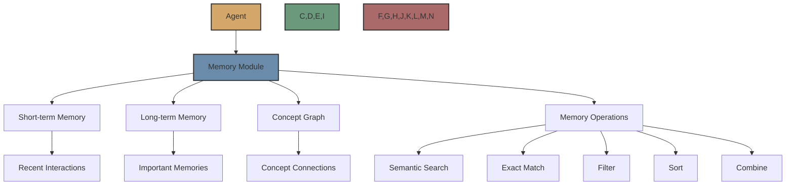

# Memory Module

The Memory Module is a powerful component in Flock that provides agents with the ability to remember and learn from past interactions. It works like human memory, with short-term and long-term storage, and a concept graph for connecting related topics.



## Overview

The Memory Module allows agents to:

- Store and retrieve memories from past interactions
- Find semantically similar memories using embeddings
- Connect related concepts in a concept graph
- Filter, sort, and combine memories using various operations
- Automatically promote frequently used memories to long-term storage

## How to Use

### Adding the Memory Module to an Agent

```python
from flock.core import Flock, FlockAgent
from flock.modules.memory import MemoryModule, MemoryModuleConfig

# Create a Flock instance
flock = Flock(model="openai/gpt-4o")

# Create an agent
agent = FlockAgent(
    name="my_agent",
    input="query: str | The query to process",
    output="result: str | The processed result",
    memory_mapping="query -> memory.semantic(threshold=0.9) -> result"
)

# Create and attach a memory module
memory_module = MemoryModule(
    name="memory",
    config=MemoryModuleConfig(
        file_path="memory.json",
        save_after_update=True
    )
)
agent.add_module(memory_module)

# Add the agent to the flock
flock.add_agent(agent)
```

### Memory Module Configuration

The `MemoryModuleConfig` class allows you to configure the memory module:

```python
from flock.modules.memory import MemoryModuleConfig

config = MemoryModuleConfig(
    file_path="memory.json",           # Path to save memory
    save_after_update=True,            # Save after each update
    max_short_term=100,                # Maximum short-term memories
    max_long_term=1000,                # Maximum long-term memories
    promotion_threshold=5,             # Access count for promotion to long-term
    decay_rate=0.9,                    # Rate at which memories decay
    embedding_model="all-MiniLM-L6-v2" # Model to use for embeddings
)
```

## Memory Mapping System

The memory mapping system allows you to define how memory should be used in a declarative way.

### Basic Syntax

Memory mappings use this pattern:
```python
"input -> operation1 | operation2 | operation3 -> output"
```
Where:
- `->` points to where data should flow
- `|` chains operations together (like pipes in Unix)
- Operations can have parameters in parentheses

### Available Operations

#### 1. Semantic Search
```python
"query -> memory.semantic(threshold=0.8)"
```
Parameters:
- `threshold`: Similarity cutoff (0-1)
- `max_results`: Maximum number of results
- `scope`: 'local', 'global', or 'both'

#### 2. Exact Match
```python
"topic -> memory.exact"
```
Looks for exact matches in memory entries. Good for when you need precise matching.

#### 3. Filter
```python
"memory.filter(recency='7d', relevance=0.5)"
```
Parameters:
- `recency`: Time window ('24h', '7d', etc.)
- `relevance`: Minimum relevance score
- `metadata`: Custom metadata filters

#### 4. Sort
```python
"memory.sort(by='relevance', ascending=False)"
```
Parameters:
- `by`: 'relevance', 'recency', or 'access_count'
- `ascending`: Sort direction

#### 5. Combine
```python
"memory.combine(weights={'semantic': 0.7, 'exact': 0.3})"
```
Merges results from different operations.

### Example Memory Mappings

#### Simple Query
```python
"topic -> memory.semantic(threshold=0.8) -> result"
```
Just finds semantically similar memories.

#### Complex Research
```python
memory_mapping = """
    topic -> memory.semantic(threshold=0.9) |
    memory.filter(recency='7d') |
    memory.sort(by='relevance')
    -> research_results
"""
```
Finds recent, highly relevant memories.

#### Multi-path Search
```python
memory_mapping = """
    topic -> memory.semantic(threshold=0.8) |
    style -> memory.exact |
    memory.combine(weights={'semantic': 0.6, 'exact': 0.4}) |
    memory.filter(recency='24h')
    -> final_results
"""
```
This:
1. Does semantic search on topic
2. Does exact match on style
3. Combines both results with weights
4. Filters to last 24 hours

## How Memories Are Stored

### Memory Entries

Each memory is stored with:

- **Inputs**: What went in (inputs to the agent)
- **Outputs**: What came out (outputs from the agent)
- **Timestamp**: When it happened
- **Access Count**: How often it's used
- **Embedding**: A vector representation of the memory (its "fingerprint")
- **Concepts**: Related concepts (like tags or keywords)

```python
memory = {
    "inputs": {"question": "How do rockets work?"},
    "outputs": {"answer": "Rockets work by..."},
    "timestamp": "2025-02-20",
    "access_count": 3,
    "concepts": ["rockets", "space", "physics"]
}
```

### Embeddings

Embeddings are vector representations of memories that capture their semantic meaning. Similar memories have similar embeddings, which allows for semantic search.

- Created using a sentence transformer model
- Used for finding related memories quickly
- Enables semantic search based on meaning, not just exact matches

### Concept Graph

The concept graph is a network of connected concepts that helps find related memories even if they use different words.

- Maintains a network of connected concepts
- Concepts are connected based on co-occurrence
- The more often concepts appear together, the stronger their connection
- Helps find related memories even if they use different words


## How Memories Are Retrieved


### Memory Scoring

Each memory gets a score based on:

```
Final Score = Similarity × Decay × Reinforcement × Decay Factor

Where:

- Similarity: How well it matches your query (0-1)
- Decay: Newer memories score higher
- Reinforcement: Frequently used memories score higher
- Decay Factor: Adjusts based on usefulness
```

### Memory Evolution

Memories change over time:

- Frequently used memories get stronger (higher decay factor)
- Unused memories fade (lower decay factor)
- Very frequently used memories move to long-term storage
- Just like how human memories work!

## Advanced Features

### Clustering

- Similar memories are grouped together
- Makes retrieval faster
- Helps identify patterns in the knowledge

### Spreading Activation

- When finding related concepts, activation "spreads" through the concept network
- Like how thinking about "rockets" might lead to "space travel" then "astronauts"
- Helps discover relevant but not obvious connections

### Automatic Promotion

- Frequently used memories automatically move to long-term storage
- Like how you remember important things better than one-off events
- Helps maintain a balance between fresh and important memories

## Example Use Cases

### Conversational Agent

```python
conversational_agent = FlockAgent(
    name="conversational_agent",
    input="user_message: str | User message",
    output="response: str | Agent response",
    memory_mapping="""
        user_message -> memory.semantic(threshold=0.8) |
        memory.filter(recency='24h') |
        memory.sort(by='relevance') |
        memory.combine
        -> context
    """
)
```

### Research Agent

```python
researcher = FlockAgent(
    name="researcher",
    input="query: str | Research query",
    output="findings: str | Research findings",
    memory_mapping="""
        query -> memory.semantic(threshold=0.9, scope='global') |
        memory.filter(recency='7d') |
        memory.enrich(tools=['web_search']) |
        memory.sort(by='relevance') |
        memory.combine
        -> findings
    """
)
```

### Knowledge Base Agent

```python
knowledge_base_agent = FlockAgent(
    name="knowledge_base_agent",
    input="query: str | Knowledge query",
    output="answer: str | Knowledge answer",
    memory_mapping="""
        query -> memory.semantic(threshold=0.9) |
        memory.filter(relevance=0.7) |
        memory.sort(by='relevance') |
        memory.combine
        -> answer
    """
)
```

## Next Steps

Now that you understand the Memory Module, you might want to explore:

- [Metrics Module](metrics.md) - Learn about the metrics module
- [Output Module](output.md) - Learn about the output module
- [Custom Modules](custom.md) - Learn how to create custom modules
- [Modules Overview](../modules.md) - Learn about the module system in general
