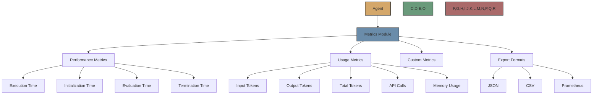

# Metrics Module

The Metrics Module is a powerful component in Flock that collects detailed performance metrics for agents. It allows you to track execution time, token usage, memory usage, API calls, and custom metrics.



## Overview

The Metrics Module allows you to:

- Track performance metrics like execution time
- Monitor resource usage like tokens and memory
- Record API calls to external services
- Define and track custom metrics
- Export metrics in various formats for analysis

## How to Use

### Adding the Metrics Module to an Agent

```python
from flock.core import Flock, FlockAgent
from flock.modules.metrics import MetricsModule, MetricsModuleConfig

# Create a Flock instance
flock = Flock(model="openai/gpt-4o")

# Create an agent
agent = FlockAgent(
    name="my_agent",
    input="query: str | The query to process",
    output="result: str | The processed result"
)

# Create and attach a metrics module
metrics_module = MetricsModule(
    name="metrics",
    config=MetricsModuleConfig(
        metrics_dir="metrics",
        track_execution_time=True,
        track_token_usage=True,
        track_memory_usage=True,
        track_api_calls=True
    )
)
agent.add_module(metrics_module)

# Add the agent to the flock
flock.add_agent(agent)
```

### Metrics Module Configuration

The `MetricsModuleConfig` class allows you to configure the metrics module:

```python
from flock.modules.metrics import MetricsModuleConfig

config = MetricsModuleConfig(
    metrics_dir="metrics",           # Directory to store metrics
    track_execution_time=True,       # Track agent execution time
    track_token_usage=True,          # Track token usage (input/output tokens)
    track_memory_usage=True,         # Track memory usage
    track_api_calls=True,            # Track API calls
    track_custom_metrics=True,       # Track custom metrics
    export_format="json",            # Export format (json, csv, prometheus)
    export_interval=60,              # Export interval in seconds
    export_endpoint="http://localhost:9090/metrics"  # Export endpoint for Prometheus
)
```

## Available Metrics

### Performance Metrics

The Metrics Module collects the following performance metrics:

- **Execution Time**: Time taken for agent execution
- **Initialization Time**: Time taken for agent initialization
- **Evaluation Time**: Time taken for agent evaluation
- **Termination Time**: Time taken for agent termination

### Usage Metrics

The Metrics Module collects the following usage metrics:

- **Input Tokens**: Number of tokens in the input
- **Output Tokens**: Number of tokens in the output
- **Total Tokens**: Total number of tokens (input + output)
- **API Calls**: Number of API calls made
- **Memory Usage**: Memory used by the agent

### Custom Metrics

You can define custom metrics by implementing the `track_custom_metrics` method in your agent:

```python
class MyAgent(FlockAgent):
    async def track_custom_metrics(self, metrics_module):
        """Track custom metrics."""
        metrics_module.record_metric("my_custom_metric", 42)
```

## Exporting Metrics

The Metrics Module can export metrics in various formats:

### JSON

```python
config = MetricsModuleConfig(
    metrics_dir="metrics",
    export_format="json"
)
```

This will export metrics as JSON files in the specified directory.

### CSV

```python
config = MetricsModuleConfig(
    metrics_dir="metrics",
    export_format="csv"
)
```

This will export metrics as CSV files in the specified directory.

### Prometheus

```python
config = MetricsModuleConfig(
    export_format="prometheus",
    export_endpoint="http://localhost:9090/metrics"
)
```

This will export metrics to a Prometheus endpoint.

## Lifecycle Hooks

The Metrics Module hooks into the agent lifecycle to collect metrics:

- **initialize**: Records the start time and initializes metrics
- **pre_evaluate**: Records the start time for evaluation
- **post_evaluate**: Records the end time for evaluation and calculates metrics
- **terminate**: Records the end time and finalizes metrics

## Example Use Cases

### Performance Monitoring

```python
from flock.core import Flock, FlockAgent
from flock.modules.metrics import MetricsModule, MetricsModuleConfig

# Create a Flock instance
flock = Flock(model="openai/gpt-4o")

# Create an agent
agent = FlockAgent(
    name="my_agent",
    input="query: str | The query to process",
    output="result: str | The processed result"
)

# Create and attach a metrics module for performance monitoring
metrics_module = MetricsModule(
    name="metrics",
    config=MetricsModuleConfig(
        metrics_dir="metrics",
        track_execution_time=True,
        export_format="json"
    )
)
agent.add_module(metrics_module)

# Add the agent to the flock
flock.add_agent(agent)
```

### Token Usage Tracking

```python
from flock.core import Flock, FlockAgent
from flock.modules.metrics import MetricsModule, MetricsModuleConfig

# Create a Flock instance
flock = Flock(model="openai/gpt-4o")

# Create an agent
agent = FlockAgent(
    name="my_agent",
    input="query: str | The query to process",
    output="result: str | The processed result"
)

# Create and attach a metrics module for token usage tracking
metrics_module = MetricsModule(
    name="metrics",
    config=MetricsModuleConfig(
        metrics_dir="metrics",
        track_token_usage=True,
        export_format="csv"
    )
)
agent.add_module(metrics_module)

# Add the agent to the flock
flock.add_agent(agent)
```

### Prometheus Integration

```python
from flock.core import Flock, FlockAgent
from flock.modules.metrics import MetricsModule, MetricsModuleConfig

# Create a Flock instance
flock = Flock(model="openai/gpt-4o")

# Create an agent
agent = FlockAgent(
    name="my_agent",
    input="query: str | The query to process",
    output="result: str | The processed result"
)

# Create and attach a metrics module for Prometheus integration
metrics_module = MetricsModule(
    name="metrics",
    config=MetricsModuleConfig(
        track_execution_time=True,
        track_token_usage=True,
        track_memory_usage=True,
        track_api_calls=True,
        export_format="prometheus",
        export_endpoint="http://localhost:9090/metrics",
        export_interval=60
    )
)
agent.add_module(metrics_module)

# Add the agent to the flock
flock.add_agent(agent)
```

## Visualizing Metrics

You can visualize metrics using various tools:

### Grafana

Grafana is a popular open-source platform for monitoring and observability. You can use it to visualize metrics exported by the Metrics Module.

1. Set up Prometheus as a data source in Grafana
2. Create dashboards to visualize metrics
3. Set up alerts for important metrics

### Jupyter Notebooks

You can use Jupyter Notebooks to analyze metrics exported as JSON or CSV files:

```python
import pandas as pd
import matplotlib.pyplot as plt

# Load metrics from CSV
metrics = pd.read_csv("metrics/agent_metrics.csv")

# Plot execution time
plt.figure(figsize=(10, 6))
plt.plot(metrics["timestamp"], metrics["execution_time"])
plt.title("Agent Execution Time")
plt.xlabel("Timestamp")
plt.ylabel("Execution Time (s)")
plt.grid(True)
plt.show()
```

## Best Practices

1. **Start Simple**: Begin with tracking execution time and token usage
2. **Add More Metrics**: Add more metrics as needed
3. **Use Appropriate Export Format**: Use JSON for debugging, CSV for analysis, and Prometheus for monitoring
4. **Set Up Alerts**: Set up alerts for important metrics
5. **Analyze Trends**: Look for trends in metrics over time
6. **Optimize Based on Metrics**: Use metrics to identify bottlenecks and optimize your agents

## Next Steps

Now that you understand the Metrics Module, you might want to explore:

- [Memory Module](memory.md) - Learn about the memory module
- [Output Module](output.md) - Learn about the output module
- [Custom Modules](custom.md) - Learn how to create custom modules
- [Modules Overview](../modules.md) - Learn about the module system in general
