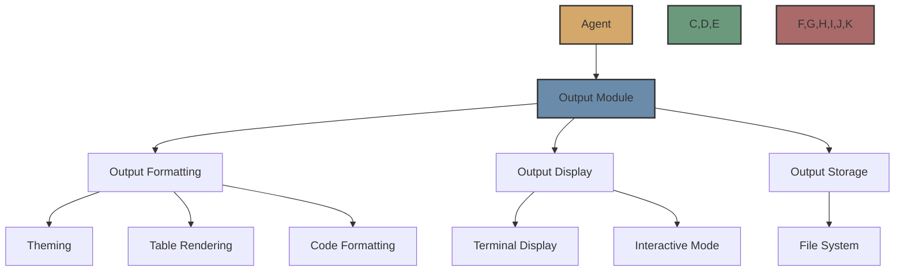

# Output Module

The Output Module is a component in Flock that formats and displays agent outputs. It allows you to customize how agent outputs are presented and optionally saved to files.



## Overview

The Output Module allows you to:

- Format agent outputs with customizable themes
- Display outputs as tables for better readability
- Apply syntax highlighting to code blocks
- Save outputs to files for later reference
- Customize output display with various options

## How to Use

### Adding the Output Module to an Agent

```python
from flock.core import Flock, FlockAgent
from flock.modules.output import OutputModule, OutputModuleConfig
from flock.core.logging.formatters.themes import OutputTheme

# Create a Flock instance
flock = Flock()

# Create an agent
agent = FlockAgent(
    name="my_agent",
    input="query: str | The query to process",
    output="result: str | The processed result"
)

# Create and attach an output module
output_module = OutputModule(
    name="output",
    config=OutputModuleConfig(
        theme=OutputTheme.afterglow,
        render_table=True,
        write_to_file=True,
        output_dir="output/"
    )
)
agent.add_module(output_module)

# Add the agent to the flock
flock.add_agent(agent)
```

### Using FlockFactory with Output Options

You can also use the FlockFactory to create an agent with output options:

```python
from flock.core import Flock, FlockFactory
from flock.core.logging.formatters.themes import OutputTheme

# Create a Flock instance
flock = Flock()

# Create an agent with output options
agent = FlockFactory.create_default_agent(
    name="my_agent",
    input="query: str | The query to process",
    output="result: str | The processed result",
    enable_rich_tables=True,
    output_theme=OutputTheme.aardvark_blue
)

# Add the agent to the flock
flock.add_agent(agent)
```

### Output Module Configuration

The `OutputModuleConfig` class allows you to configure the output module:

```python
from flock.modules.output import OutputModuleConfig
from flock.core.logging.formatters.themes import OutputTheme

config = OutputModuleConfig(
    theme=OutputTheme.afterglow,        # Theme for output formatting
    render_table=False,                 # Whether to render output as a table
    max_length=1000,                    # Maximum length for displayed output
    wait_for_input=False,               # Whether to wait for user input after display
    write_to_file=False,                # Whether to save output to file
    output_dir="output/",               # Directory for saving output files
    truncate_long_values=True,          # Whether to truncate long values in display
    show_metadata=True,                 # Whether to show metadata like timestamps
    format_code_blocks=True,            # Whether to apply syntax highlighting to code blocks
    custom_formatters={}                # Custom formatters for specific output types
)
```

## Output Themes

Flock supports a wide range of output themes through the `OutputTheme` enum:

```python
from flock.core.logging.formatters.themes import OutputTheme

# Some available themes
theme = OutputTheme.afterglow        # Default theme
theme = OutputTheme.aardvark_blue    # Blue theme
theme = OutputTheme.dracula          # Dark theme
theme = OutputTheme.github           # Light theme
theme = OutputTheme.monokai          # Colorful theme
```

You can update the theme at runtime:

```python
output_module.update_theme(OutputTheme.dracula)
```

## Table Rendering

You can enable table rendering for better visualization of structured outputs:

```python
config = OutputModuleConfig(
    render_table=True
)
```

This is particularly useful for outputs with multiple fields or list items.

## File Output

You can save outputs to files for later reference:

```python
config = OutputModuleConfig(
    write_to_file=True,
    output_dir="output/"
)
```

Each output will be saved as a JSON file with metadata.

## Custom Formatters

You can add custom formatters for specific output keys:

```python
output_module.add_custom_formatter("code", "code_block")
```

This will use a special formatter for the "code" field in the output.

## Lifecycle Hooks

The Output Module hooks into the agent lifecycle:

- **post_evaluate**: Formats and displays the output after evaluation

## Example Use Cases

### Rich Table Output with Theme

```python
from flock.core import Flock, FlockFactory
from flock.core.logging.formatters.themes import OutputTheme
from flock.core.tools import basic_tools

# Create a Flock instance
flock = Flock()

# Create an agent with rich table output
agent = FlockFactory.create_default_agent(
    name="web_content_agent",
    input="url: str | The URL to process",
    output="title: str, headings: list[str], type: str",
    tools=[basic_tools.get_web_content_as_markdown],
    enable_rich_tables=True,
    output_theme=OutputTheme.aardvark_blue
)

# Add the agent to the flock
flock.add_agent(agent)

# Run the agent
result = flock.run(
    start_agent=agent,
    input={"url": "https://example.com"}
)
```

### Output with File Saving

```python
from flock.core import Flock, FlockAgent
from flock.modules.output import OutputModule, OutputModuleConfig
from flock.core.logging.formatters.themes import OutputTheme

# Create a Flock instance
flock = Flock()

# Create an agent
agent = FlockAgent(
    name="my_agent",
    input="query: str | The query to process",
    output="result: str | The processed result"
)

# Create and attach an output module with file saving
output_module = OutputModule(
    name="output",
    config=OutputModuleConfig(
        theme=OutputTheme.github,
        render_table=True,
        write_to_file=True,
        output_dir="output/",
        show_metadata=True
    )
)
agent.add_module(output_module)

# Add the agent to the flock
flock.add_agent(agent)
```

### Interactive Output

```python
from flock.core import Flock, FlockAgent
from flock.modules.output import OutputModule, OutputModuleConfig
from flock.core.logging.formatters.themes import OutputTheme

# Create a Flock instance
flock = Flock()

# Create an agent
agent = FlockAgent(
    name="my_agent",
    input="query: str | The query to process",
    output="result: str | The processed result"
)

# Create and attach an output module with interactive mode
output_module = OutputModule(
    name="output",
    config=OutputModuleConfig(
        theme=OutputTheme.monokai,
        render_table=True,
        wait_for_input=True,
        format_code_blocks=True
    )
)
agent.add_module(output_module)

# Add the agent to the flock
flock.add_agent(agent)
```

## Real-World Example

Here's a real-world example from the Flock examples:

```python
from pprint import pprint
from flock.core import Flock, FlockFactory
from flock.core.logging.formatters.themes import OutputTheme
from flock.core.tools import basic_tools

# Create the flock
flock = Flock()

# Create an agent with typed output and rich tables
agent = FlockFactory.create_default_agent(
    name="my_agent",
    input="url",
    output="title, headings: list[str]," 
            "entities_and_metadata: list[dict[str, str]]," 
            "type:Literal['news', 'blog', 'opinion piece', 'tweet']",
    tools=[basic_tools.get_web_content_as_markdown],
    enable_rich_tables=True,
    output_theme=OutputTheme.aardvark_blue,
)
flock.add_agent(agent)

# Run the agent
result = flock.run(
    start_agent=agent,
    input={"url": "https://lite.cnn.com/travel/alexander-the-great-macedon-persian-empire-darius/index.html"},
)

# Access the result as a Python object
pprint(result.title)
```

## Best Practices

1. **Choose the Right Theme**: Select a theme that matches your application's style
2. **Use Tables for Structured Data**: Enable table rendering for structured outputs
3. **Format Code Blocks**: Enable code block formatting for better readability
4. **Save Important Outputs**: Enable file saving for important outputs
5. **Truncate Long Values**: Enable truncation for long values to avoid cluttered displays
6. **Show Metadata**: Include metadata for context

## Next Steps

Now that you understand the Output Module, you might want to explore:

- [Memory Module](memory.md) - Learn about the memory module
- [Metrics Module](metrics.md) - Learn about the metrics module
- [Custom Modules](custom.md) - Learn how to create custom modules
- [Modules Overview](../modules.md) - Learn about the module system in general
