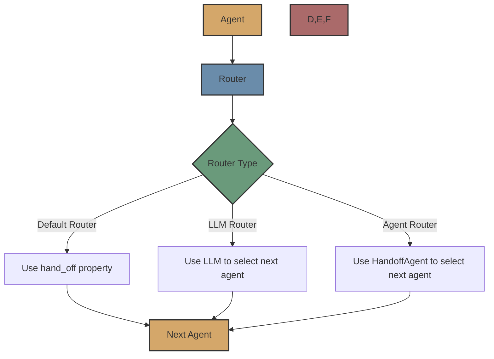

# Routers

Routers are a key component of the Flock framework that determine the next agent in a workflow based on the current agent's output.



## Overview

Routers are responsible for determining the next agent in a workflow based on the current agent's output. They enable the creation of complex, dynamic workflows that can adapt to the specific context and content of the agent's output.

Flock provides three types of routers:

1. **[Default Router](routers/default.md)**: Uses the agent's `hand_off` property to determine the next agent
2. **[LLM Router](routers/llm.md)**: Uses a language model to score each available agent and select the best one
3. **[Agent Router](routers/agent.md)**: Uses a dedicated `HandoffAgent` to determine the next agent

## Router Architecture

All routers in Flock extend the base `FlockRouter` class, which defines the common interface and functionality:

```python
class FlockRouter(BaseModel, ABC):
    name: str
    config: FlockRouterConfig
    
    @abstractmethod
    async def route(
        self,
        current_agent: FlockAgent,
        result: dict[str, Any],
        context: FlockContext,
    ) -> HandOff:
        pass
```

The `route` method is the core of the router, responsible for determining the next agent based on the current agent's output. It returns a `HandOff` object that specifies the next agent and the input data to pass to it.

## Router Configuration

Each router type has its own configuration class that extends the base `FlockRouterConfig`:

```python
class FlockRouterConfig(BaseModel):
    name: str = "default_router"
    enabled: bool = True
    confidence_threshold: float = 0.5
```

The `confidence_threshold` parameter is used by the LLM Router and Agent Router to determine if a potential next agent is suitable. If the confidence score is below this threshold, the workflow ends.

## Attaching Routers to Agents

Routers are attached to agents using the `handoff_router` property:

```python
from flock.core import Flock, FlockAgent
from flock.routers.llm.llm_router import LLMRouter, LLMRouterConfig

# Create a Flock instance
flock = Flock()

# Create an agent
agent = FlockAgent(
    name="my_agent",
    input="query: str | The query to process",
    output="result: str | The processed result"
)

# Create and attach a router
router = LLMRouter(
    registry=None,  # Will be set by the framework
    config=LLMRouterConfig(
        confidence_threshold=0.7
    )
)
agent.handoff_router = router

# Add the agent to the flock
flock.add_agent(agent)
```

If no router is explicitly attached to an agent, the Default Router is used, which relies on the agent's `hand_off` property.

## HandOff Class

The `HandOff` class is used to specify the next agent in a workflow and the input data to pass to it:

```python
class HandOff(BaseModel):
    next_agent: Union[str, FlockAgent, Callable]
    input: dict[str, Any] = Field(default_factory=dict)
    context: dict[str, Any] = Field(default_factory=dict)
```

- `next_agent`: The next agent to invoke (either a string name, a FlockAgent instance, or a callable that returns an agent)
- `input`: Input data for the next agent
- `context`: Override context parameters

## Input Mapping

All routers attempt to map the current agent's output to the next agent's input. If the next agent expects an input field with the same name as an output field from the current agent, the value is automatically passed along.

Additionally, routers add a special field called `previous_agent_output` to the next agent's input, which contains the name of the previous agent and its complete output.

The LLM Router and Agent Router provide more sophisticated input mapping capabilities, with the Agent Router offering the most control through the `HandoffDecision.input_mapping` field.

## Choosing the Right Router

Each router has its own strengths and is suitable for different scenarios:

### Default Router

- **Strengths**: Simple, explicit control, no additional configuration
- **Best for**: Simple, linear workflows with predetermined agent sequences
- **Example**: A fixed sequence of agents for a specific task

### LLM Router

- **Strengths**: Dynamic routing, intelligent selection, explainable decisions
- **Best for**: Complex workflows with multiple potential paths
- **Example**: A workflow that adapts to the content of the agent's output

### Agent Router

- **Strengths**: Sophisticated routing, explicit input mapping, customizable
- **Best for**: Complex workflows with specialized routing logic
- **Example**: A workflow that requires complex decision-making for routing

## Example: Using Different Routers

```python
from flock.core import Flock, FlockAgent, HandOff
from flock.routers.llm.llm_router import LLMRouter, LLMRouterConfig
from flock.routers.agent.agent_router import AgentRouter, AgentRouterConfig

# Create a Flock instance
flock = Flock()

# Create agents
research_agent = FlockAgent(
    name="research_agent",
    description="Researches a topic and provides detailed findings",
    input="topic: str | The topic to research",
    output="findings: str | Detailed research findings"
)

summary_agent = FlockAgent(
    name="summary_agent",
    description="Creates a concise summary of research findings",
    input="findings: str | The research findings to summarize",
    output="summary: str | A concise summary of the findings"
)

blog_agent = FlockAgent(
    name="blog_agent",
    description="Creates a well-structured blog post based on research",
    input="findings: str | The research findings to use for the blog",
    output="blog_post: str | A complete blog post"
)

presentation_agent = FlockAgent(
    name="presentation_agent",
    description="Creates a presentation outline based on research",
    input="findings: str | The research findings to use for the presentation",
    output="presentation: str | A presentation outline"
)

# Use Default Router for research_agent (explicit handoff)
research_agent.hand_off = summary_agent

# Use LLM Router for summary_agent
llm_router = LLMRouter(
    registry=None,
    config=LLMRouterConfig(
        temperature=0.1,
        confidence_threshold=0.7
    )
)
summary_agent.handoff_router = llm_router

# Use Agent Router for blog_agent
agent_router = AgentRouter(
    registry=None,
    config=AgentRouterConfig(
        confidence_threshold=0.6
    )
)
blog_agent.handoff_router = agent_router

# Add agents to the flock
flock.add_agent(research_agent)
flock.add_agent(summary_agent)
flock.add_agent(blog_agent)
flock.add_agent(presentation_agent)

# Run the workflow
result = flock.run(
    start_agent=research_agent,
    input={"topic": "Artificial Intelligence"}
)
```

## Next Steps

Now that you understand routers, you might want to explore:

- [Default Router](routers/default.md) - Learn about the Default Router in detail
- [LLM Router](routers/llm.md) - Learn about the LLM Router in detail
- [Agent Router](routers/agent.md) - Learn about the Agent Router in detail
- [Workflows](workflows.md) - Learn about workflow execution in Flock
- [Agents](agents.md) - Learn about agents in Flock
