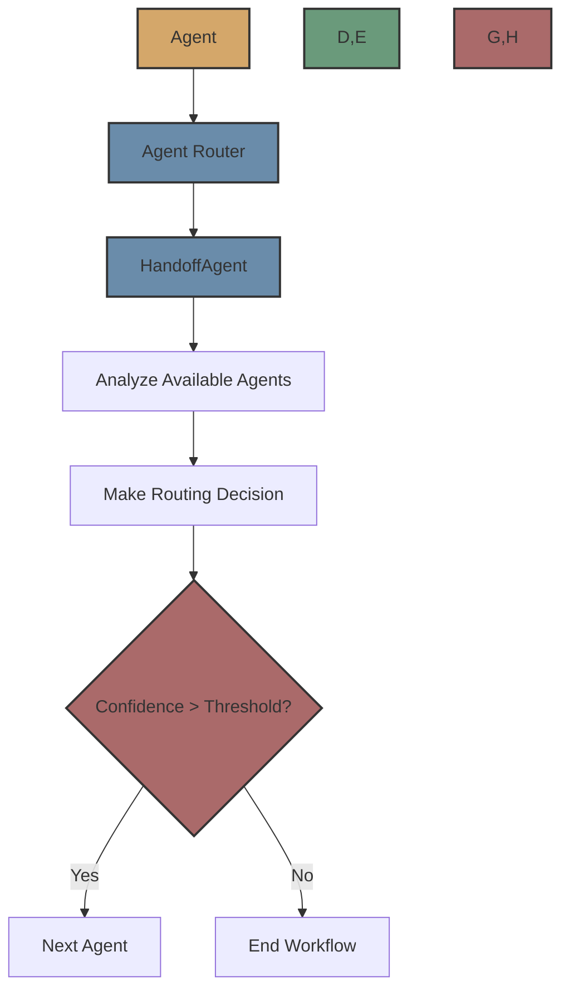

# Agent Router

The Agent Router uses a dedicated agent to dynamically determine the next agent in a workflow based on the current agent's output.



## Overview

The Agent Router is an advanced routing mechanism that uses a dedicated `HandoffAgent` to analyze the current agent's output and the available agents to determine the best next agent in a workflow. This approach allows for sophisticated routing logic that can be customized and improved over time.

## How It Works

1. The agent completes its execution
2. The Agent Router gets all available agents from the registry
3. It prepares input for the HandoffAgent, including:
   - Information about the current agent
   - The current agent's output
   - Information about all available agents
4. It runs the HandoffAgent to determine the next agent
5. The HandoffAgent returns a decision with:
   - The name of the selected agent
   - A confidence score
   - A reasoning for the selection
   - An input mapping for the next agent
6. If the confidence score exceeds the threshold, the router selects that agent
7. It creates input for the next agent by mapping the current agent's output
8. If no agent exceeds the threshold, the workflow ends

## Implementation Details

The Agent Router is implemented in `src/flock/routers/agent/agent_router.py`. It extends the base `FlockRouter` class and implements the `route` method to determine the next agent in a workflow.

The router uses a dedicated `HandoffAgent` (implemented in `src/flock/routers/agent/handoff_agent.py`) that is a regular `FlockAgent` with specialized input and output schemas:

- **Input**: Information about the current agent, its output, and available agents
- **Output**: A `HandoffDecision` object with the selected agent, confidence score, reasoning, and input mapping

## Usage

To use the Agent Router, you need to create an instance and attach it to an agent using the `handoff_router` property:

```python
from flock.core import Flock, FlockAgent
from flock.routers.agent.agent_router import AgentRouter, AgentRouterConfig

# Create a Flock instance
flock = Flock()

# Create agents
agent1 = FlockAgent(
    name="agent1",
    description="Researches a topic and provides detailed findings",
    input="topic: str | The topic to research",
    output="findings: str | Detailed research findings"
)

agent2 = FlockAgent(
    name="agent2",
    description="Creates a concise summary of research findings",
    input="findings: str | The research findings to summarize",
    output="summary: str | A concise summary of the findings"
)

agent3 = FlockAgent(
    name="agent3",
    description="Creates a well-structured blog post based on research",
    input="findings: str | The research findings to use for the blog",
    output="blog_post: str | A complete blog post"
)

# Create and attach an Agent Router to agent1
agent_router = AgentRouter(
    registry=None,  # Will be set by the framework
    config=AgentRouterConfig(
        confidence_threshold=0.6,  # Minimum confidence score required to select an agent
    )
)
agent1.handoff_router = agent_router

# Add agents to the flock
flock.add_agent(agent1)
flock.add_agent(agent2)
flock.add_agent(agent3)

# Run the workflow
result = flock.run(
    start_agent=agent1,
    input={"topic": "Artificial Intelligence"}
)
```

## Configuration

The `AgentRouterConfig` class allows you to configure the Agent Router:

```python
from flock.routers.agent.agent_router import AgentRouterConfig

config = AgentRouterConfig(
    name="agent_router",  # Name of the router
    enabled=True,  # Whether the router is enabled
    confidence_threshold=0.6  # Minimum confidence score required to select an agent
)
```

## HandoffAgent

The `HandoffAgent` is a specialized agent that makes routing decisions. It takes the following input:

```python
input=(
    "current_agent_name: str | Name of the current agent, "
    "current_agent_description: str | Description of the current agent, "
    "current_agent_input: str | Input schema of the current agent, "
    "current_agent_output: str | Output schema of the current agent, "
    "current_result: dict | Output from the current agent, "
    "available_agents: list[AgentInfo] | List of available agents"
)
```

And produces the following output:

```python
output="decision: HandoffDecision | Decision about which agent to hand off to"
```

Where `HandoffDecision` is a Pydantic model with:

```python
class HandoffDecision(BaseModel):
    agent_name: str
    confidence: float
    reasoning: str = ""
    input_mapping: dict[str, str] = Field(default_factory=dict)
```

## Input Mapping

The Agent Router supports sophisticated input mapping through the `HandoffDecision.input_mapping` field. This allows the `HandoffAgent` to specify exactly how to map the current agent's output to the next agent's input.

For example, if the current agent's output has a field called `research_findings` and the next agent expects a field called `findings`, the `HandoffAgent` can specify:

```python
input_mapping = {
    "findings": "research_findings"
}
```

Additionally, the router adds a special field called `previous_agent_output` to the next agent's input, which contains the name of the previous agent and its complete output.

## Advantages

- **Sophisticated Routing**: The HandoffAgent can implement complex routing logic
- **Input Mapping**: Explicit control over how to map inputs between agents
- **Explainable Decisions**: The HandoffAgent provides reasoning for its selection
- **Customizable**: The HandoffAgent can be customized and improved over time
- **Confidence Scoring**: Each routing decision includes a confidence score

## Limitations

- **Complexity**: More complex than the Default Router or LLM Router
- **Latency**: Running the HandoffAgent adds latency to the routing decision
- **Cost**: Each routing decision incurs a cost for running the HandoffAgent
- **Setup**: Requires setting up and configuring the HandoffAgent

## When to Use

Use the Agent Router when:

- You need sophisticated routing logic that goes beyond what the LLM Router can provide
- You want explicit control over input mapping between agents
- You want to customize and improve the routing logic over time
- You need detailed reasoning for routing decisions

## Next Steps

Now that you understand the Agent Router, you might want to explore:

- [Default Router](default.md) - Learn about the simpler Default Router
- [LLM Router](llm.md) - Learn about the LLM Router for dynamic routing
- [Routers Overview](../routers.md) - Learn about the routing system in general
