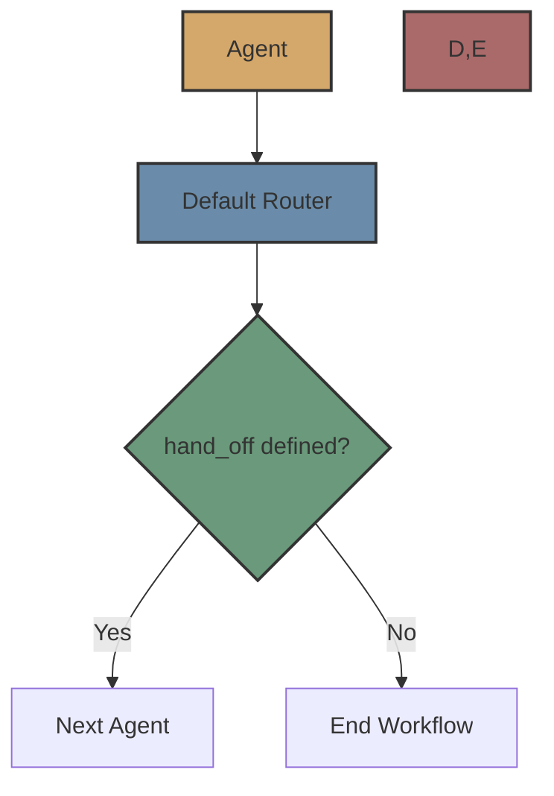

# Default Router

The Default Router is the simplest router in Flock. It uses the agent's `hand_off` property to determine the next agent in a workflow.



## Overview

The Default Router is the default routing mechanism in Flock. It simply checks if the agent has a `hand_off` property defined, and if so, routes to the specified agent. If no `hand_off` is defined, the workflow ends.

## How It Works

1. The agent completes its execution
2. The Default Router checks if the agent has a `hand_off` property
3. If `hand_off` is defined, the router routes to the specified agent
4. If `hand_off` is not defined, the workflow ends
5. The router also attempts to map the current agent's output to the next agent's input

## Implementation Details

The Default Router is implemented in `src/flock/routers/default/default_router.py`. It extends the base `FlockRouter` class and implements the `route` method to determine the next agent in a workflow.

The router supports three types of `hand_off` values:
1. **String**: The name of the next agent
2. **Callable**: A function that returns a `HandOff` object
3. **HandOff object**: A direct specification of the next agent and input data

## Usage

The Default Router is used automatically when no other router is specified. You don't need to explicitly create or configure it.

```python
from flock.core import Flock, FlockAgent

# Create a Flock instance
flock = Flock()

# Create agents
agent1 = FlockAgent(
    name="agent1",
    input="query: str | The query to process",
    output="intermediate_result: str | Intermediate result"
)

agent2 = FlockAgent(
    name="agent2",
    input="intermediate_result: str | Intermediate result",
    output="final_result: str | Final result"
)

# Set up handoff
agent1.hand_off = agent2

# Add agents to the flock
flock.add_agent(agent1)
flock.add_agent(agent2)

# Run the workflow
result = flock.run(
    start_agent=agent1,
    input={"query": "Hello, world!"}
)
```

## HandOff Class

For more complex handoff scenarios, you can use the `HandOff` class:

```python
from flock.core import Flock, FlockAgent, HandOff

# Create a Flock instance
flock = Flock()

# Create agents
agent1 = FlockAgent(
    name="agent1",
    input="query: str | The query to process",
    output="intermediate_result: str | Intermediate result"
)

agent2 = FlockAgent(
    name="agent2",
    input="intermediate_result: str | Intermediate result, additional_data: str | Additional data",
    output="final_result: str | Final result"
)

# Set up handoff with additional input
agent1.hand_off = HandOff(
    next_agent=agent2,
    input={"additional_data": "some value"}
)

# Add agents to the flock
flock.add_agent(agent1)
flock.add_agent(agent2)

# Run the workflow
result = flock.run(
    start_agent=agent1,
    input={"query": "Hello, world!"}
)
```

## Dynamic HandOff

You can also use a function to dynamically determine the next agent:

```python
from flock.core import Flock, FlockAgent, HandOff

# Create a Flock instance
flock = Flock()

# Create agents
agent1 = FlockAgent(
    name="agent1",
    input="query: str | The query to process",
    output="intermediate_result: str | Intermediate result, route_to: str | Next agent to route to"
)

agent2 = FlockAgent(
    name="agent2",
    input="intermediate_result: str | Intermediate result",
    output="final_result: str | Final result"
)

agent3 = FlockAgent(
    name="agent3",
    input="intermediate_result: str | Intermediate result",
    output="final_result: str | Final result"
)

# Define a function to determine the next agent
def determine_next_agent(context, result):
    if result.get("route_to") == "agent2":
        return HandOff(next_agent="agent2")
    else:
        return HandOff(next_agent="agent3")

# Set up dynamic handoff
agent1.hand_off = determine_next_agent

# Add agents to the flock
flock.add_agent(agent1)
flock.add_agent(agent2)
flock.add_agent(agent3)

# Run the workflow
result = flock.run(
    start_agent=agent1,
    input={"query": "Hello, world!"}
)
```

## Input Mapping

The Default Router automatically attempts to map the current agent's output to the next agent's input. If the next agent expects an input field with the same name as an output field from the current agent, the value is automatically passed along.

Additionally, the router adds a special field called `previous_agent_output` to the next agent's input, which contains the name of the previous agent and its complete output.

## Advantages

- **Simplicity**: The Default Router is simple and easy to understand
- **Explicit Control**: You have explicit control over the workflow
- **No Configuration**: No additional configuration is required
- **Automatic Input Mapping**: Basic input mapping is handled automatically

## Limitations

- **Static Routing**: The routing is predetermined and doesn't adapt to the agent's output
- **Limited Flexibility**: The router can't make complex routing decisions based on the agent's output
- **Manual Setup**: You need to manually set up the `hand_off` property for each agent

## When to Use

Use the Default Router when:

- You have a simple, linear workflow
- You know the exact sequence of agents in advance
- You don't need complex routing logic

## Next Steps

Now that you understand the Default Router, you might want to explore:

- [LLM Router](llm.md) - Learn about the LLM Router for dynamic routing
- [Agent Router](agent.md) - Learn about the Agent Router for agent-based routing
- [Routers Overview](../routers.md) - Learn about the routing system in general
