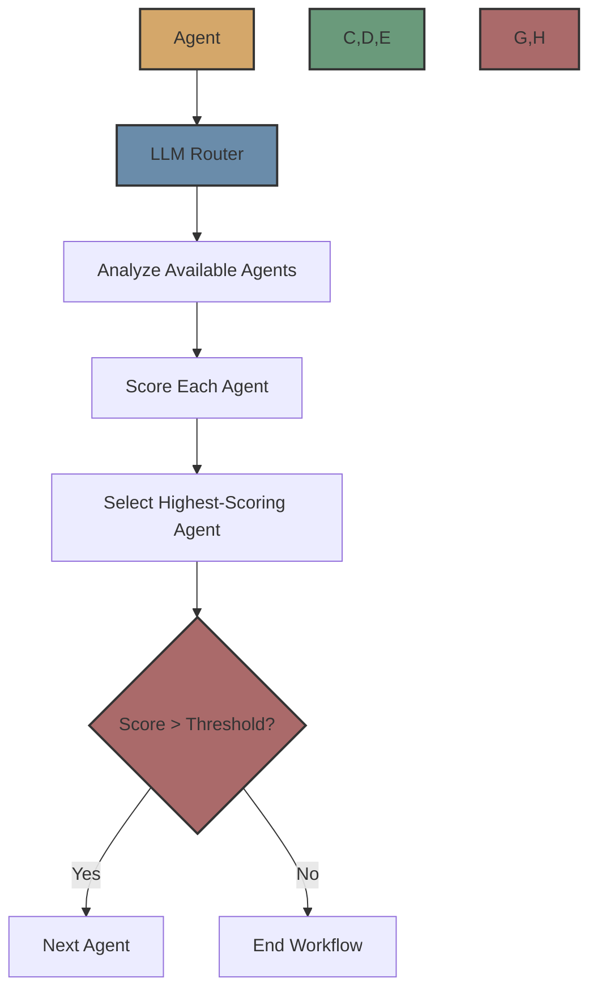

# LLM Router

The LLM Router uses a language model to dynamically determine the next agent in a workflow based on the current agent's output.



## Overview

The LLM Router is a sophisticated routing mechanism that uses a language model to analyze the current agent's output and the available agents to determine the best next agent in a workflow. It scores each available agent based on how well it matches the current agent's output and selects the highest-scoring agent.

## How It Works

1. The agent completes its execution
2. The LLM Router gets all available agents from the registry
3. It creates a prompt for the language model that includes:
   - Information about the current agent
   - The current agent's output
   - Information about all available agents
4. It calls the language model to score each available agent
5. It selects the highest-scoring agent that exceeds the confidence threshold
6. It creates input for the next agent by mapping the current agent's output
7. If no agent exceeds the threshold, the workflow ends

## Implementation Details

The LLM Router is implemented in `src/flock/routers/llm/llm_router.py`. It extends the base `FlockRouter` class and implements the `route` method to determine the next agent in a workflow.

The router uses the LiteLLM library to call the language model and expects a JSON response with:
- `next_agent`: The name of the selected agent
- `score`: A confidence score between 0 and 1
- `reasoning`: A brief explanation of why this agent was selected

## Usage

To use the LLM Router, you need to create an instance and attach it to an agent using the `handoff_router` property:

```python
from flock.core import Flock, FlockAgent
from flock.routers.llm.llm_router import LLMRouter, LLMRouterConfig

# Create a Flock instance
flock = Flock()

# Create agents
agent1 = FlockAgent(
    name="agent1",
    description="Researches a topic and provides detailed findings",
    input="topic: str | The topic to research",
    output="findings: str | Detailed research findings"
)

agent2 = FlockAgent(
    name="agent2",
    description="Creates a concise summary of research findings",
    input="findings: str | The research findings to summarize",
    output="summary: str | A concise summary of the findings"
)

agent3 = FlockAgent(
    name="agent3",
    description="Creates a well-structured blog post based on research",
    input="findings: str | The research findings to use for the blog",
    output="blog_post: str | A complete blog post"
)

# Create and attach an LLM Router to agent1
llm_router = LLMRouter(
    registry=None,  # Will be set by the framework
    config=LLMRouterConfig(
        temperature=0.1,  # Lower temperature for more deterministic decisions
        confidence_threshold=0.7,  # Higher threshold for more confident decisions
    )
)
agent1.handoff_router = llm_router

# Add agents to the flock
flock.add_agent(agent1)
flock.add_agent(agent2)
flock.add_agent(agent3)

# Run the workflow
result = flock.run(
    start_agent=agent1,
    input={"topic": "Artificial Intelligence"}
)
```

## Configuration

The `LLMRouterConfig` class allows you to configure the LLM Router:

```python
from flock.routers.llm.llm_router import LLMRouterConfig

config = LLMRouterConfig(
    name="llm_router",  # Name of the router
    enabled=True,  # Whether the router is enabled
    confidence_threshold=0.7,  # Minimum confidence score required to select an agent
    temperature=0.1,  # Temperature for the language model
    max_tokens=500  # Maximum tokens for the language model response
)
```

## Input Mapping

The LLM Router automatically attempts to map the current agent's output to the next agent's input. If the next agent expects an input field with the same name as an output field from the current agent, the value is automatically passed along.

Additionally, the router adds a special field called `previous_agent_output` to the next agent's input, which contains the name of the previous agent and its complete output.

## Prompt Engineering

The LLM Router uses a carefully crafted prompt to guide the language model in selecting the next agent. The prompt includes:

1. Information about the current agent (name, description, input, output)
2. The current agent's output
3. Information about all available agents (name, description, input, output)
4. Instructions for scoring each agent and providing a reasoning

The language model is asked to consider:
1. Which agent's input requirements best match the current agent's output
2. Which agent's purpose and description make it the most logical next step
3. Which agent would provide the most value in continuing the workflow

## Advantages

- **Dynamic Routing**: The router adapts to the agent's output
- **Intelligent Selection**: The language model can make sophisticated routing decisions
- **Confidence Scoring**: Each potential next agent is scored based on its suitability
- **Automatic Input Mapping**: Basic input mapping is handled automatically
- **Explainable Decisions**: The language model provides reasoning for its selection

## Limitations

- **Latency**: Calling a language model adds latency to the routing decision
- **Cost**: Each routing decision incurs a cost for the language model API call
- **Reliability**: The language model may not always make the optimal decision
- **Configuration**: Requires more configuration than the Default Router

## When to Use

Use the LLM Router when:

- You have a complex workflow with multiple potential paths
- The next agent depends on the content of the current agent's output
- You want the system to automatically determine the best next step
- You need flexibility in your workflow

## Next Steps

Now that you understand the LLM Router, you might want to explore:

- [Default Router](default.md) - Learn about the simpler Default Router
- [Agent Router](agent.md) - Learn about the Agent Router for agent-based routing
- [Routers Overview](../routers.md) - Learn about the routing system in general
