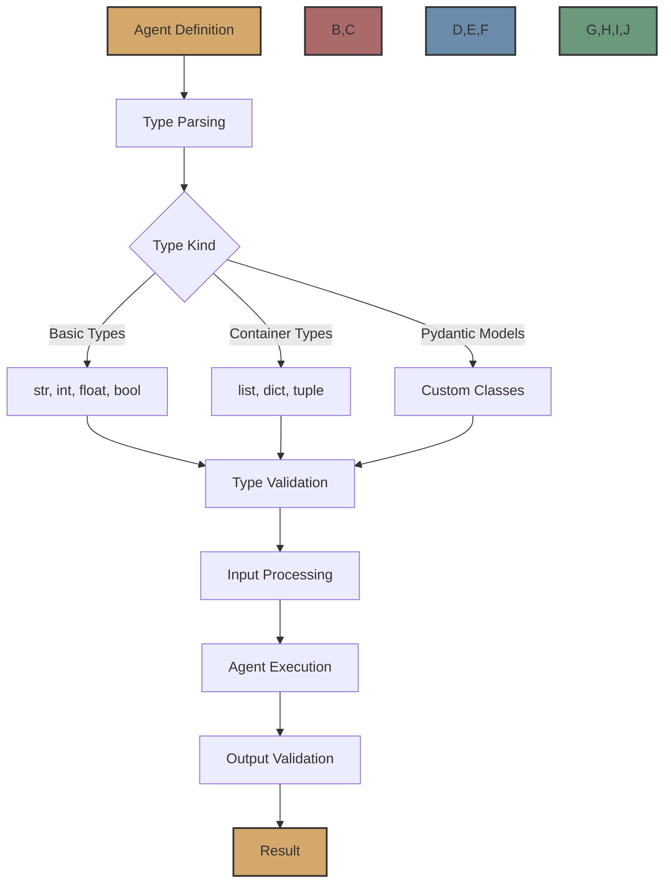

# Type System

Flock's type system provides a powerful way to define, validate, and document the inputs and outputs of agents. It combines Python's type hints with Pydantic's validation capabilities to create a robust and flexible system.



## Type Hints in Flock

Flock uses a simple syntax for defining types in agent inputs and outputs:

```
field_name: type | description
```

Where:
- `field_name` is the name of the input or output field
- `type` is the Python type hint (optional)
- `description` is a human-readable description of the field (optional)

For example:

```python
agent = FlockAgent(
    name="my_agent",
    input="query: str | The query to process",
    output="result: str | The processed result"
)
```

## Supported Types

Flock supports a wide range of types:

### Basic Types

- `str`: String values
- `int`: Integer values
- `float`: Floating-point values
- `bool`: Boolean values (True/False)

```python
agent = FlockAgent(
    name="calculator",
    input="""
        operation: str | The operation to perform (add, subtract, multiply, divide)
        a: int | The first number
        b: int | The second number
    """,
    output="result: float | The result of the operation"
)
```

### Container Types

- `list[T]`: A list of items of type T
- `dict[K, V]`: A dictionary with keys of type K and values of type V
- `tuple[T1, T2, ...]`: A tuple with items of specified types

```python
agent = FlockAgent(
    name="list_processor",
    input="numbers: list[int] | A list of integers",
    output="""
        sum: int | The sum of the numbers
        average: float | The average of the numbers
        sorted: list[int] | The sorted list of numbers
    """
)
```

### Optional Types

- `Optional[T]` or `T | None`: A value that can be of type T or None

```python
agent = FlockAgent(
    name="search_agent",
    input="""
        query: str | The search query
        limit: Optional[int] | The maximum number of results to return (default: 10)
    """,
    output="results: list[str] | The search results"
)
```

### Union Types

- `Union[T1, T2, ...]` or `T1 | T2 | ...`: A value that can be of any of the specified types

```python
agent = FlockAgent(
    name="flexible_processor",
    input="value: Union[str, int, float] | A value to process",
    output="processed: str | The processed value"
)
```

### Pydantic Models

For more complex types, you can use Pydantic models:

```python
from pydantic import BaseModel, Field

class Person(BaseModel):
    name: str
    age: int
    email: str = Field(pattern=r"^[a-zA-Z0-9_.+-]+@[a-zA-Z0-9-]+\.[a-zA-Z0-9-.]+$")

class Address(BaseModel):
    street: str
    city: str
    country: str
    postal_code: str

class Contact(BaseModel):
    person: Person
    address: Address
    phone_numbers: list[str]

agent = FlockAgent(
    name="contact_processor",
    input="contact_info: dict | The contact information",
    output="contact: Contact | The processed contact"
)
```

## Type Parsing and Validation

When an agent is created, Flock parses the type hints in the input and output definitions. During execution, Flock validates the inputs and outputs against these types.

### Input Validation

Before an agent is executed, Flock validates the inputs against the defined types. If the inputs don't match the expected types, Flock raises an error.

```python
agent = FlockAgent(
    name="calculator",
    input="""
        operation: str | The operation to perform (add, subtract, multiply, divide)
        a: int | The first number
        b: int | The second number
    """,
    output="result: float | The result of the operation"
)

# This will work
result = agent.run({"operation": "add", "a": 1, "b": 2})

# This will raise an error because 'a' is a string, not an int
result = agent.run({"operation": "add", "a": "1", "b": 2})
```

### Output Validation

After an agent is executed, Flock validates the outputs against the defined types. If the outputs don't match the expected types, Flock raises an error.

```python
class MyAgent(FlockAgent):
    async def evaluate(self, inputs):
        # This will work
        return {"result": 3.0}
        
        # This will raise an error because 'result' is an int, not a float
        # return {"result": 3}
```

## Type Coercion

In some cases, Flock will attempt to coerce values to the expected types. For example, if an input is defined as an `int` but a string is provided, Flock will try to convert the string to an integer.

```python
agent = FlockAgent(
    name="calculator",
    input="""
        operation: str | The operation to perform (add, subtract, multiply, divide)
        a: int | The first number
        b: int | The second number
    """,
    output="result: float | The result of the operation"
)

# This will work because '1' can be converted to 1
result = agent.run({"operation": "add", "a": "1", "b": "2"})
```

## Type Documentation

Type hints also serve as documentation for the agent's inputs and outputs. When an agent is created, Flock generates a schema that describes the expected inputs and outputs.

```python
agent = FlockAgent(
    name="calculator",
    input="""
        operation: str | The operation to perform (add, subtract, multiply, divide)
        a: int | The first number
        b: int | The second number
    """,
    output="result: float | The result of the operation"
)

print(agent.input_schema)
# {
#     "type": "object",
#     "properties": {
#         "operation": {
#             "type": "string",
#             "description": "The operation to perform (add, subtract, multiply, divide)"
#         },
#         "a": {
#             "type": "integer",
#             "description": "The first number"
#         },
#         "b": {
#             "type": "integer",
#             "description": "The second number"
#         }
#     },
#     "required": ["operation", "a", "b"]
# }
```

## Benefits of the Type System

Flock's type system provides several benefits:

1. **Validation**: Ensures that inputs and outputs match the expected types
2. **Documentation**: Provides clear documentation for the agent's inputs and outputs
3. **Autocomplete**: Enables IDE autocomplete for agent inputs and outputs
4. **Error Messages**: Provides clear error messages when types don't match
5. **Integration**: Integrates with Pydantic for complex type validation

## Best Practices

When using Flock's type system, consider the following best practices:

1. **Be Specific**: Use specific types rather than generic ones (e.g., `list[int]` instead of `list`)
2. **Add Descriptions**: Include descriptions for all inputs and outputs
3. **Use Pydantic Models**: For complex types, use Pydantic models
4. **Validate Early**: Validate inputs as early as possible
5. **Handle Errors**: Implement error handling for type validation errors

## Next Steps

Now that you understand Flock's type system, you might want to explore:

- [Agents](agents.md) - Learn more about Flock agents
- [Pydantic Integration](../features/pydantic.md) - Explore Flock's integration with Pydantic
- [Type Safety](../features/type-safety.md) - Learn about Flock's type safety features
- [Examples](../examples/type-system.md) - See examples of the type system in action
