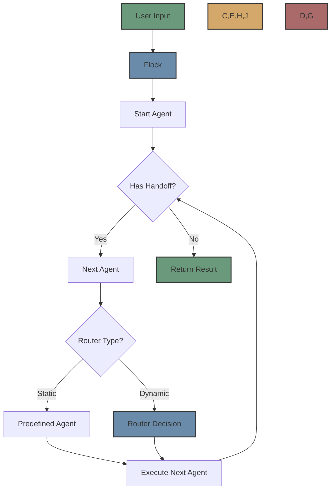
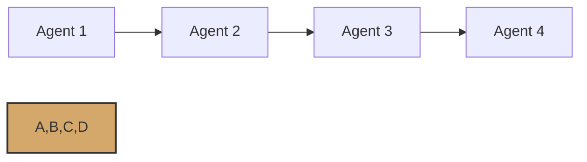
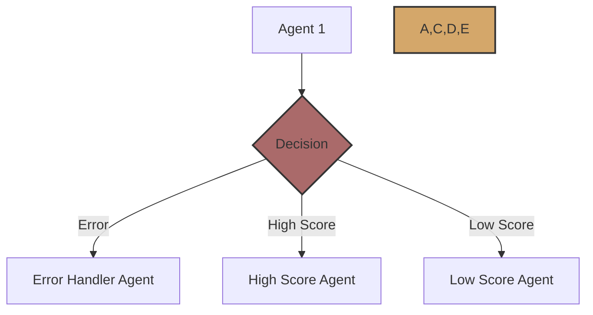
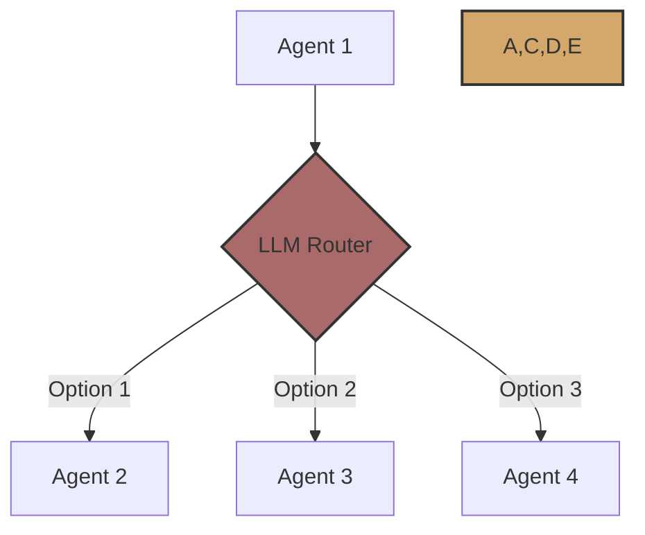

# Workflows

Workflows in Flock represent the execution flow of agents, defining how they interact and chain together to accomplish complex tasks. Flock provides a flexible and powerful workflow system that can adapt to different use cases.



## What are Workflows?

In Flock, a workflow is a sequence of agent executions that work together to accomplish a task. Workflows can be:

1. **Linear**: Agents execute in a predetermined sequence
2. **Branching**: The next agent depends on the output of the current agent
3. **Dynamic**: The workflow evolves based on agent outputs and router decisions

Workflows are defined implicitly through agent handoffs and routers, rather than requiring explicit workflow definitions.

## Workflow Execution

Flock supports two execution modes:

### Local Execution

Local execution is the default mode when `local_debug=True` is set in the Flock constructor. This mode is useful for development and debugging.

```python
flock = Flock(model="openai/gpt-4o", local_debug=True)
```

In local execution mode:
- Agents run synchronously in the same process
- Errors are raised immediately
- No persistence or fault tolerance

### Temporal Execution

Temporal execution is enabled when `local_debug=False` is set in the Flock constructor. This mode provides production-grade workflow execution.

```python
flock = Flock(model="openai/gpt-4o", local_debug=False)
```

In Temporal execution mode:
- Agents run as Temporal activities
- Workflows are durable and can survive process crashes
- Automatic retries for failed activities
- Built-in monitoring and observability

## Workflow Components

### Flock

The `Flock` class is the main orchestrator for workflows. It manages the registration of agents and tools, sets up the global context, and runs the agent workflows.

```python
from flock.core import Flock

flock = Flock(model="openai/gpt-4o")
```

### Agents

Agents are the building blocks of workflows. Each agent has a specific task and can hand off to other agents.

```python
from flock.core import FlockAgent

agent = FlockAgent(
    name="my_agent",
    input="query: str | The query to process",
    output="result: str | The processed result"
)
```

### Handoffs

Handoffs define the next agent in a workflow. There are several ways to specify handoffs:

#### Static Handoff

```python
# Direct reference to another agent
agent1.hand_off = agent2

# Reference by name
agent1.hand_off = "agent2"

# HandOff object with additional input
agent1.hand_off = HandOff(
    next_agent=agent2,
    input={"additional_data": "some value"}
)
```

#### Dynamic Handoff with Routers

```python
from flock.routers.llm.llm_router import LLMRouter, LLMRouterConfig

# Create a router
router = LLMRouter(
    registry=None,  # Will be set by the framework
    config=LLMRouterConfig(
        temperature=0.2,
        confidence_threshold=0.7,
    )
)

# Attach the router to the agent
agent1.handoff_router = router
```

### Context

The `FlockContext` maintains the global execution context, including variables that are shared across agents in a workflow.

```python
from flock.core.context.context import FlockContext

context = FlockContext()
context.set_variable("key", "value")
value = context.get_variable("key")
```

## Running Workflows

To run a workflow, use the `run` method of the Flock instance:

```python
result = flock.run(
    start_agent=agent1,
    input={"query": "Hello, world!"}
)
```

For asynchronous execution, use the `run_async` method:

```python
result = await flock.run_async(
    start_agent=agent1,
    input={"query": "Hello, world!"}
)
```

## Workflow Patterns

### Linear Workflow

In a linear workflow, agents execute in a predetermined sequence:

```python
agent1.hand_off = agent2
agent2.hand_off = agent3
agent3.hand_off = agent4
```



### Branching Workflow

In a branching workflow, the next agent depends on the output of the current agent:

```python
def determine_next_agent(inputs, result):
    if "error" in result:
        return "error_handler_agent"
    elif result["score"] > 0.5:
        return "high_score_agent"
    else:
        return "low_score_agent"

agent1.hand_off = determine_next_agent
```



### Dynamic Workflow with Routers

In a dynamic workflow, the next agent is determined by a router:

```python
from flock.routers.llm.llm_router import LLMRouter, LLMRouterConfig

router = LLMRouter(
    registry=None,
    config=LLMRouterConfig(
        temperature=0.2,
        confidence_threshold=0.7,
    )
)

agent1.handoff_router = router
```



## Error Handling

Flock provides several mechanisms for error handling in workflows:

### Agent Error Handling

Agents can implement the `on_error` method to handle errors:

```python
class MyAgent(FlockAgent):
    async def on_error(self, error, inputs):
        print(f"Error: {error}")
        return {"error": str(error)}
```

### Module Error Handling

Modules can implement the `on_error` method to handle errors:

```python
class MyModule(FlockModule):
    async def on_error(self, agent, error, inputs):
        print(f"Module error handler: {error}")
        return inputs
```

### Temporal Retries

When using Temporal execution, activities can be configured to retry automatically:

```python
from flock.core.execution.temporal_executor import TemporalExecutorConfig

config = TemporalExecutorConfig(
    retry_attempts=3,
    retry_interval=5,
)
```

## Best Practices

When designing workflows, consider the following best practices:

1. **Keep Agents Focused**: Each agent should have a single, well-defined responsibility.
2. **Use Appropriate Handoff Mechanisms**: Choose the right handoff mechanism for your use case.
3. **Consider Error Handling**: Implement error handling at appropriate levels.
4. **Test Workflows Thoroughly**: Test your workflows with different inputs to ensure they behave as expected.
5. **Monitor Workflow Execution**: Use Temporal's monitoring capabilities to track workflow execution.
6. **Use Context Appropriately**: Use the context to share data between agents when necessary.

## Next Steps

Now that you understand workflows, you might want to explore:

- [Agents](agents.md) - Learn more about Flock agents
- [Routers](routers.md) - Understand how routers work
- [Temporal Integration](../integrations/temporal.md) - Learn about Temporal integration
- [Complex Workflows](../advanced/complex-workflows.md) - Explore more complex workflow patterns
