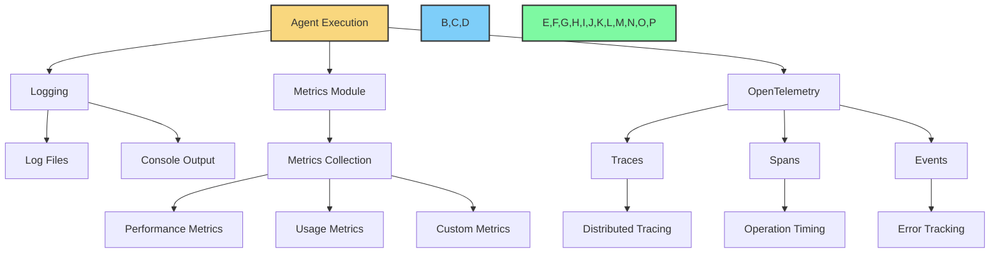

# Monitoring, Metrics, and Telemetry

Flock provides comprehensive monitoring, metrics, and telemetry capabilities to help you understand how your agents are performing and to diagnose issues in production. This is achieved through a combination of logging, metrics collection via modules, and OpenTelemetry integration.



## Logging

Flock uses a structured logging system that provides detailed information about agent execution. Logs are color-coded for better readability and can be configured to output to different destinations.

### Enabling Logging

Logging can be enabled when creating a Flock instance:

```python
from flock.core import Flock

# Enable all logging
flock = Flock(model="openai/gpt-4o", enable_logging=True)

# Or enable specific loggers
flock = Flock(
    model="openai/gpt-4o",
    enable_logging=["flock", "agent", "memory"]
)
```

### Log Levels

Flock supports the following log levels:

- **DEBUG**: Detailed information, typically of interest only when diagnosing problems
- **INFO**: Confirmation that things are working as expected
- **WARNING**: An indication that something unexpected happened, or may happen in the near future
- **ERROR**: Due to a more serious problem, the software has not been able to perform some function
- **CRITICAL**: A serious error, indicating that the program itself may be unable to continue running

### Log Format

Logs are structured and include the following information:

- **Timestamp**: When the log was generated
- **Level**: The log level (DEBUG, INFO, etc.)
- **Logger**: The name of the logger (e.g., "flock", "agent", "memory")
- **Message**: The log message
- **Context**: Additional context information (agent name, inputs, etc.)

Example log output:

```
2025-02-25 01:23:45,678 [INFO] flock.agent: Agent 'my_agent' started execution
2025-02-25 01:23:46,789 [INFO] flock.agent: Agent 'my_agent' completed execution in 1.111s
```

### Custom Logging

You can customize logging by providing your own logger:

```python
import logging

# Configure your logger
logging.basicConfig(
    level=logging.INFO,
    format="%(asctime)s [%(levelname)s] %(name)s: %(message)s",
    handlers=[
        logging.FileHandler("flock.log"),
        logging.StreamHandler()
    ]
)

# Create a Flock instance with your logger
flock = Flock(
    model="openai/gpt-4o",
    logger=logging.getLogger("my_flock")
)
```

## Metrics Module

Flock provides a `MetricsModule` that collects detailed performance metrics for agents. This module can be attached to any agent to track its performance.

### Enabling Metrics

To enable metrics collection, attach the `MetricsModule` to your agents:

```python
from flock.core import Flock, FlockAgent
from flock.modules.metrics import MetricsModule, MetricsModuleConfig

# Create a Flock instance
flock = Flock(model="openai/gpt-4o")

# Create an agent
agent = FlockAgent(
    name="my_agent",
    input="query: str | The query to process",
    output="result: str | The processed result"
)

# Create and attach a metrics module
metrics_module = MetricsModule(
    name="metrics",
    config=MetricsModuleConfig(
        metrics_dir="metrics",
        track_execution_time=True,
        track_token_usage=True,
        track_memory_usage=True,
        track_api_calls=True,
    )
)
agent.add_module(metrics_module)

# Add the agent to the flock
flock.add_agent(agent)
```

### Metrics Configuration

The `MetricsModuleConfig` class allows you to configure the metrics module:

```python
from flock.modules.metrics import MetricsModuleConfig

config = MetricsModuleConfig(
    metrics_dir="metrics",           # Directory to store metrics
    track_execution_time=True,       # Track agent execution time
    track_token_usage=True,          # Track token usage (input/output tokens)
    track_memory_usage=True,         # Track memory usage
    track_api_calls=True,            # Track API calls
    track_custom_metrics=True,       # Track custom metrics
    export_format="json",            # Export format (json, csv, prometheus)
    export_interval=60,              # Export interval in seconds
    export_endpoint="http://localhost:9090/metrics"  # Export endpoint for Prometheus
)
```

### Available Metrics

The `MetricsModule` collects the following metrics:

#### Performance Metrics

- **Execution Time**: Time taken for agent execution
- **Initialization Time**: Time taken for agent initialization
- **Evaluation Time**: Time taken for agent evaluation
- **Termination Time**: Time taken for agent termination

#### Usage Metrics

- **Input Tokens**: Number of tokens in the input
- **Output Tokens**: Number of tokens in the output
- **Total Tokens**: Total number of tokens (input + output)
- **API Calls**: Number of API calls made
- **Memory Usage**: Memory used by the agent

#### Custom Metrics

You can define custom metrics by implementing the `track_custom_metrics` method in your agent:

```python
class MyAgent(FlockAgent):
    async def track_custom_metrics(self, metrics_module):
        """Track custom metrics."""
        metrics_module.record_metric("my_custom_metric", 42)
```

### Exporting Metrics

Metrics can be exported in various formats:

- **JSON**: Export metrics as JSON files
- **CSV**: Export metrics as CSV files
- **Prometheus**: Export metrics to a Prometheus endpoint

```python
from flock.modules.metrics import MetricsModuleConfig

# Export metrics as JSON
config = MetricsModuleConfig(
    metrics_dir="metrics",
    export_format="json"
)

# Export metrics as CSV
config = MetricsModuleConfig(
    metrics_dir="metrics",
    export_format="csv"
)

# Export metrics to Prometheus
config = MetricsModuleConfig(
    export_format="prometheus",
    export_endpoint="http://localhost:9090/metrics"
)
```

## OpenTelemetry Integration

Flock integrates with [OpenTelemetry](https://opentelemetry.io/) to provide distributed tracing and metrics collection. This allows you to track agent execution across multiple services and to visualize the performance of your agent workflows.

### Enabling OpenTelemetry

To enable OpenTelemetry, set `enable_telemetry=True` when creating a Flock instance:

```python
from flock.core import Flock

# Enable OpenTelemetry
flock = Flock(
    model="openai/gpt-4o",
    enable_telemetry=True
)
```

### OpenTelemetry Configuration

You can configure OpenTelemetry by providing a configuration object:

```python
from flock.core import Flock
from flock.core.telemetry.telemetry_config import TelemetryConfig

# Configure OpenTelemetry
telemetry_config = TelemetryConfig(
    service_name="my-flock-service",
    exporter_type="otlp",
    exporter_endpoint="http://localhost:4317",
    resource_attributes={
        "deployment.environment": "production"
    }
)

# Create a Flock instance with OpenTelemetry
flock = Flock(
    model="openai/gpt-4o",
    enable_telemetry=True,
    telemetry_config=telemetry_config
)
```

### Traces and Spans

OpenTelemetry creates traces and spans for agent execution:

- **Trace**: A trace represents the end-to-end execution of a workflow
- **Span**: A span represents a single operation within a trace

For example, when running an agent workflow, OpenTelemetry creates:

- A trace for the entire workflow
- Spans for each agent execution
- Spans for agent lifecycle events (initialize, evaluate, terminate)
- Spans for tool usage

### Exporting Telemetry Data

Telemetry data can be exported to various backends:

- **OTLP**: OpenTelemetry Protocol (default)
- **Jaeger**: Jaeger tracing backend
- **Zipkin**: Zipkin tracing backend
- **Prometheus**: Prometheus metrics backend

```python
from flock.core.telemetry.telemetry_config import TelemetryConfig

# Export to OTLP
config = TelemetryConfig(
    exporter_type="otlp",
    exporter_endpoint="http://localhost:4317"
)

# Export to Jaeger
config = TelemetryConfig(
    exporter_type="jaeger",
    exporter_endpoint="http://localhost:14268/api/traces"
)

# Export to Zipkin
config = TelemetryConfig(
    exporter_type="zipkin",
    exporter_endpoint="http://localhost:9411/api/v2/spans"
)

# Export to Prometheus
config = TelemetryConfig(
    exporter_type="prometheus",
    exporter_endpoint="http://localhost:9090/metrics"
)
```

### Custom Spans

You can create custom spans in your agents to track specific operations:

```python
from flock.core import FlockAgent
from flock.core.telemetry.telemetry import get_tracer

class MyAgent(FlockAgent):
    async def evaluate(self, inputs):
        # Get the tracer
        tracer = get_tracer("my_agent")
        
        # Create a custom span
        with tracer.start_as_current_span("custom_operation") as span:
            # Set span attributes
            span.set_attribute("operation.name", "custom_operation")
            span.set_attribute("operation.input", str(inputs))
            
            # Perform the operation
            result = await self._process_inputs(inputs)
            
            # Set span attributes for the result
            span.set_attribute("operation.result", str(result))
            
            return result
```

## Visualizing Monitoring Data

Flock's monitoring data can be visualized using various tools:

### Logging Visualization

- **Kibana**: Visualize logs stored in Elasticsearch
- **Grafana Loki**: Visualize logs stored in Loki
- **Papertrail**: Cloud-based log management

### Metrics Visualization

- **Grafana**: Visualize metrics stored in Prometheus
- **Datadog**: Cloud-based metrics monitoring
- **New Relic**: Cloud-based metrics monitoring

### Tracing Visualization

- **Jaeger UI**: Visualize traces stored in Jaeger
- **Zipkin UI**: Visualize traces stored in Zipkin
- **Grafana Tempo**: Visualize traces stored in Tempo

## Example: Comprehensive Monitoring Setup

Here's an example of a comprehensive monitoring setup for Flock:

```python
from flock.core import Flock, FlockAgent
from flock.modules.metrics import MetricsModule, MetricsModuleConfig
from flock.core.telemetry.telemetry_config import TelemetryConfig

# Configure telemetry
telemetry_config = TelemetryConfig(
    service_name="my-flock-service",
    exporter_type="otlp",
    exporter_endpoint="http://localhost:4317",
    resource_attributes={
        "deployment.environment": "production"
    }
)

# Create a Flock instance with logging and telemetry
flock = Flock(
    model="openai/gpt-4o",
    enable_logging=True,
    enable_telemetry=True,
    telemetry_config=telemetry_config
)

# Create an agent
agent = FlockAgent(
    name="my_agent",
    input="query: str | The query to process",
    output="result: str | The processed result"
)

# Create and attach a metrics module
metrics_module = MetricsModule(
    name="metrics",
    config=MetricsModuleConfig(
        metrics_dir="metrics",
        track_execution_time=True,
        track_token_usage=True,
        track_memory_usage=True,
        track_api_calls=True,
        export_format="prometheus",
        export_endpoint="http://localhost:9090/metrics"
    )
)
agent.add_module(metrics_module)

# Add the agent to the flock
flock.add_agent(agent)

# Run the agent
result = flock.run(
    start_agent=agent,
    input={"query": "Hello, world!"}
)
```

This setup provides:

- **Logging**: Detailed logs of agent execution
- **Metrics**: Performance and usage metrics via the metrics module
- **Telemetry**: Distributed tracing via OpenTelemetry

## Best Practices

When setting up monitoring for Flock, consider the following best practices:

1. **Start Simple**: Begin with basic logging and add metrics and telemetry as needed
2. **Monitor What Matters**: Focus on metrics that are relevant to your use case
3. **Set Up Alerts**: Configure alerts for critical metrics to be notified of issues
4. **Use Sampling**: For high-volume systems, use sampling to reduce the amount of telemetry data
5. **Correlate Data**: Use trace IDs to correlate logs, metrics, and traces
6. **Secure Sensitive Data**: Ensure that sensitive data is not included in logs or telemetry
7. **Regularly Review**: Regularly review monitoring data to identify trends and issues

## Next Steps

Now that you understand monitoring in Flock, you might want to explore:

- [Production Setup](production-setup.md) - Set up Flock for production
- [Scalability](scalability.md) - Scale Flock for high-volume workloads
- [Security](security.md) - Secure your Flock deployment
- [Temporal Integration](../integrations/temporal.md) - Learn about Temporal integration
