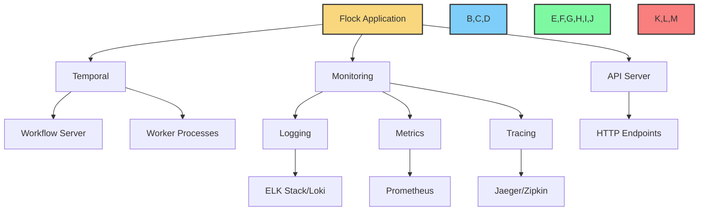

# Production Setup

This guide provides instructions for setting up Flock in a production environment. While Flock can be used for development and testing with its local execution mode, production deployments benefit from additional features like fault tolerance, scalability, and monitoring.



## Prerequisites

Before setting up Flock for production, ensure you have:

- Python 3.9 or higher
- Docker (for containerization)
- Temporal server (for workflow orchestration)
- Monitoring infrastructure (for logging, metrics, and tracing)

## Production Architecture

A typical production deployment of Flock consists of:

1. **Flock Application**: Your Python application that uses Flock
2. **Temporal Server**: For workflow orchestration and fault tolerance
3. **Monitoring Infrastructure**: For logging, metrics, and tracing
4. **API Server**: For exposing agents via HTTP endpoints

## Setting Up Temporal

Temporal is a critical component for production deployments of Flock. It provides workflow orchestration, fault tolerance, and scalability.

### Option 1: Self-Hosted Temporal

To set up a self-hosted Temporal server:

1. **Using Docker Compose**:

```yaml
# docker-compose.yml
version: '3'
services:
  temporal:
    image: temporalio/auto-setup:1.20.0
    ports:
      - "7233:7233"
    environment:
      - CASSANDRA_SEEDS=cassandra
      - DYNAMIC_CONFIG_FILE_PATH=config/dynamicconfig/development.yaml
    depends_on:
      - cassandra
    volumes:
      - ./dynamicconfig:/etc/temporal/config/dynamicconfig
  
  temporal-ui:
    image: temporalio/ui:2.10.3
    ports:
      - "8233:8080"
    environment:
      - TEMPORAL_ADDRESS=temporal:7233
    depends_on:
      - temporal
  
  cassandra:
    image: cassandra:3.11
    ports:
      - "9042:9042"
```

2. **Start the services**:

```bash
docker-compose up -d
```

3. **Configure Flock to use Temporal**:

```python
from flock.core import Flock
from flock.core.execution.temporal_executor import TemporalExecutorConfig

flock = Flock(
    model="openai/gpt-4o",
    local_debug=False,  # Use Temporal
    temporal_executor_config=TemporalExecutorConfig(
        server_url="localhost:7233",
        namespace="default",
        task_queue="flock-queue"
    )
)
```

### Option 2: Temporal Cloud

For a managed Temporal service, you can use [Temporal Cloud](https://temporal.io/cloud):

1. **Sign up for Temporal Cloud**
2. **Create a namespace**
3. **Configure Flock to use Temporal Cloud**:

```python
from flock.core import Flock
from flock.core.execution.temporal_executor import TemporalExecutorConfig

flock = Flock(
    model="openai/gpt-4o",
    local_debug=False,  # Use Temporal
    temporal_executor_config=TemporalExecutorConfig(
        server_url="your-namespace.tmprl.cloud:7233",
        namespace="your-namespace",
        tls_cert_path="/path/to/cert.pem",
        tls_key_path="/path/to/key.pem"
    )
)
```

## Setting Up Monitoring

Monitoring is essential for production deployments. Flock integrates with various monitoring tools.

### Logging

Configure logging to capture important events:

```python
import logging

# Configure logging
logging.basicConfig(
    level=logging.INFO,
    format="%(asctime)s [%(levelname)s] %(name)s: %(message)s",
    handlers=[
        logging.FileHandler("flock.log"),
        logging.StreamHandler()
    ]
)

# Create a Flock instance with logging enabled
flock = Flock(
    model="openai/gpt-4o",
    enable_logging=True,
    logger=logging.getLogger("flock")
)
```

For production, consider using a centralized logging system like ELK Stack (Elasticsearch, Logstash, Kibana) or Grafana Loki.

### Metrics

Use the MetricsModule to collect performance metrics:

```python
from flock.core import Flock, FlockAgent
from flock.modules.metrics import MetricsModule, MetricsModuleConfig

# Create a metrics module
metrics_module = MetricsModule(
    name="metrics",
    config=MetricsModuleConfig(
        metrics_dir="metrics",
        track_execution_time=True,
        track_token_usage=True,
        track_memory_usage=True,
        track_api_calls=True,
        export_format="prometheus",
        export_endpoint="http://localhost:9090/metrics"
    )
)

# Create an agent with metrics
agent = FlockAgent(
    name="my_agent",
    input="query: str",
    output="result: str"
)
agent.add_module(metrics_module)

# Add the agent to the flock
flock = Flock(model="openai/gpt-4o")
flock.add_agent(agent)
```

For production, consider using Prometheus and Grafana for metrics visualization.

### Tracing

Enable OpenTelemetry for distributed tracing:

```python
from flock.core import Flock
from flock.core.telemetry.telemetry_config import TelemetryConfig

# Configure telemetry
telemetry_config = TelemetryConfig(
    service_name="flock-service",
    exporter_type="otlp",
    exporter_endpoint="http://localhost:4317",
    resource_attributes={
        "deployment.environment": "production"
    }
)

# Create a Flock instance with telemetry
flock = Flock(
    model="openai/gpt-4o",
    enable_telemetry=True,
    telemetry_config=telemetry_config
)
```

For production, consider using Jaeger or Zipkin for tracing visualization.

## Setting Up the API Server

To expose your agents via HTTP endpoints, use the Flock API server:

```python
from flock.core import Flock, FlockAgent
from flock.core.flock_api import FlockAPI

# Create a Flock instance
flock = Flock(model="openai/gpt-4o")

# Create and add an agent
agent = FlockAgent(
    name="my_agent",
    input="query: str",
    output="result: str"
)
flock.add_agent(agent)

# Create the API server
api = FlockAPI(flock)

# Start the server
api.start(host="0.0.0.0", port=8344)
```

For production, consider using a production-grade ASGI server like Uvicorn with Gunicorn:

```bash
gunicorn -w 4 -k uvicorn.workers.UvicornWorker your_module:api.app
```

## Containerization

Containerizing your Flock application makes it easier to deploy and scale:

### Dockerfile

```dockerfile
FROM python:3.9-slim

WORKDIR /app

# Copy requirements
COPY requirements.txt .

# Install dependencies
RUN pip install --no-cache-dir -r requirements.txt

# Copy application code
COPY . .

# Expose API port
EXPOSE 8344

# Start the application
CMD ["gunicorn", "-w", "4", "-k", "uvicorn.workers.UvicornWorker", "your_module:api.app"]
```

### requirements.txt

```
flock-core>=0.3.0
gunicorn>=20.1.0
uvicorn>=0.17.6
```

### Docker Compose

```yaml
# docker-compose.yml
version: '3'
services:
  flock-api:
    build: .
    ports:
      - "8344:8344"
    environment:
      - OPENAI_API_KEY=your-api-key
      - FLOCK_MODEL=openai/gpt-4o
      - FLOCK_LOCAL_DEBUG=false
      - FLOCK_TEMPORAL_SERVER_URL=temporal:7233
    depends_on:
      - temporal
  
  temporal:
    image: temporalio/auto-setup:1.20.0
    ports:
      - "7233:7233"
    environment:
      - CASSANDRA_SEEDS=cassandra
    depends_on:
      - cassandra
  
  cassandra:
    image: cassandra:3.11
    ports:
      - "9042:9042"
```

## Kubernetes Deployment

For production deployments, Kubernetes provides scalability and resilience:

### Deployment

```yaml
# deployment.yaml
apiVersion: apps/v1
kind: Deployment
metadata:
  name: flock-api
spec:
  replicas: 3
  selector:
    matchLabels:
      app: flock-api
  template:
    metadata:
      labels:
        app: flock-api
    spec:
      containers:
      - name: flock-api
        image: your-registry/flock-api:latest
        ports:
        - containerPort: 8344
        env:
        - name: OPENAI_API_KEY
          valueFrom:
            secretKeyRef:
              name: flock-secrets
              key: openai-api-key
        - name: FLOCK_MODEL
          value: "openai/gpt-4o"
        - name: FLOCK_LOCAL_DEBUG
          value: "false"
        - name: FLOCK_TEMPORAL_SERVER_URL
          value: "temporal:7233"
        resources:
          limits:
            cpu: "1"
            memory: "2Gi"
          requests:
            cpu: "500m"
            memory: "1Gi"
```

### Service

```yaml
# service.yaml
apiVersion: v1
kind: Service
metadata:
  name: flock-api
spec:
  selector:
    app: flock-api
  ports:
  - port: 80
    targetPort: 8344
  type: ClusterIP
```

### Ingress

```yaml
# ingress.yaml
apiVersion: networking.k8s.io/v1
kind: Ingress
metadata:
  name: flock-api
  annotations:
    nginx.ingress.kubernetes.io/ssl-redirect: "true"
spec:
  rules:
  - host: api.your-domain.com
    http:
      paths:
      - path: /
        pathType: Prefix
        backend:
          service:
            name: flock-api
            port:
              number: 80
  tls:
  - hosts:
    - api.your-domain.com
    secretName: your-tls-secret
```

## Security Considerations

When deploying Flock in production, consider these security best practices:

1. **API Keys**: Store API keys as environment variables or in a secure vault
2. **Authentication**: Add authentication to your API server
3. **Rate Limiting**: Implement rate limiting to prevent abuse
4. **Input Validation**: Validate all inputs to prevent injection attacks
5. **HTTPS**: Use HTTPS for all communications
6. **Network Isolation**: Isolate components in separate networks
7. **Least Privilege**: Run containers with minimal permissions

## Performance Optimization

To optimize performance in production:

1. **Caching**: Cache frequently used results
2. **Asynchronous Execution**: Use asynchronous execution for long-running operations
3. **Horizontal Scaling**: Deploy multiple instances behind a load balancer
4. **Resource Allocation**: Allocate appropriate CPU and memory resources
5. **Connection Pooling**: Use connection pooling for database connections
6. **Batch Processing**: Process requests in batches when possible
7. **Model Selection**: Choose appropriate models based on performance requirements

## Deployment Checklist

Before deploying to production, ensure:

- [ ] All API keys and secrets are securely stored
- [ ] Logging is configured and centralized
- [ ] Metrics collection is enabled
- [ ] Tracing is configured
- [ ] Security measures are in place
- [ ] Performance is optimized
- [ ] Monitoring alerts are set up
- [ ] Backup and recovery procedures are in place
- [ ] Scaling strategy is defined
- [ ] Documentation is up to date

## Next Steps

Now that you have set up Flock for production, you might want to explore:

- [Monitoring](monitoring.md) - Learn more about monitoring Flock
- [Scalability](scalability.md) - Understand how to scale Flock
- [Security](security.md) - Learn about securing your Flock deployment
- [Temporal Integration](../integrations/temporal.md) - Learn more about Temporal integration
