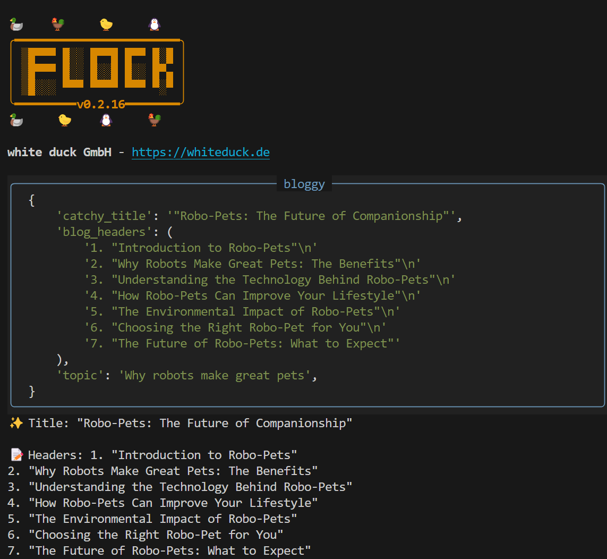

# Quick Start Guide

Ready to join the Flock? Let's get you flying! 🐤

## 🚀 Before We Take Off 

Here's what you'll need for your journey:

- Python 3.10+ 
- An OpenAI API key (or any other LLM provider - we're not picky!)
- pip (or your favorite Python package manager)

## 🛬 Landing the Basics 

First things first, let's get Flock installed:

```bash
pip install flock-core
```

Want some extra tools in your toolkit? We've got you covered:

```bash
# For the core tools
pip install flock-core[tools]

# For ALL the tools (document processing included! Will download pytorch!)
pip install flock-core[all-tools]
```

## 🪹 Setting Up Your Nest 

Time to set up your environment! You've got two ways to do this:

Either tell your terminal about your API key:
```bash
# linux + mac
export OPENAI_API_KEY=your-super-secret-key

# windows terminal
set OPENAI_API_KEY=your-super-secret-key
# or powershell
$env:OPENAI_API_KEY = "your-super-secret-key"

```

Or create a cozy `.env` file:
```plaintext
OPENAI_API_KEY=your-super-secret-key
```

Or suprise 3rd way:

Ignore the api key and use your favorite local model! See next section on how easy it is!

## 🐥 Your First Flock Friend 

Let's create your first agent! Make a new file called `first_agent.py` and let's get coding:

```python
from flock.core import Flock, FlockAgent

# Get your flock ready for action!
flock = Flock(
    model="openai/gpt-4",  # Pick your favorite model
    # model="ollama_chat/qwen2.5-coder:14b" or use your favorite local model!
    local_debug=True       # See what's happening behind the scenes
)

# Meet your new AI friend
bloggy = FlockFactory.create_default_agent(
    name="bloggy",
    input="topic",
    output="catchy_title, blog_headers"
)

# Add your friend to the flock
flock.add_agent(bloggy)

# Let's see what they can do!
result = flock.run(
    start_agent=bloggy,
    input={"topic": "Why robots make great pets"}
)

# Check out their work
print("✨ Title:", result.catchy_title)
print("\n📝 Headers:", result.blog_headers)
```

Which will result in something similar to this:

{ width="600" }


## 🤔 What Just Happened? 

Let's break down the magic:

1. **Getting the Flock Together**:
   ```python
   flock = Flock(model="openai/gpt-4", local_debug=True)
   ```
   This is like creating a cozy home for your AI agents!

2. **Creating Your First Agent**:
   ```python
   bloggy = FlockFactory.create_default_agent(
        name="bloggy",
        input="topic",
        output="catchy_title, blog_headers"
    )
   ```
   The FlockFactory is churning out your agents.
   Think of this as defining your agent's job description - what they need and what they'll create.

3. **Action Time!**:
   ```python
   result = flock.run(start_agent=bloggy, input={"topic": "Why robots make great pets"})
   ```
   This is where the magic happens! Your agent gets to work creating awesome content.

4. **Results**:
    ```python
    print("✨ Title:", result.catchy_title)
    print("\n📝 Headers:", result.blog_headers)

    ✨ Title: "Robo-Pets: The Future of Companionship"

    📝 Headers: 1. "Introduction to Robo-Pets"
    2. "Why Robots Make Great Pets: The Benefits"
    3. "Understanding the Technology Behind Robo-Pets"
    4. "How Robo-Pets Can Improve Your Lifestyle"
    5. "The Environmental Impact of Robo-Pets"
    6. "Choosing the Right Robo-Pet for You"
    7. "The Future of Robo-Pets: What to Expect"
    ```

As you can see, you wouldn't even need to print out the results yourself. Each agent can present its output itself.
This should highlight how you can use the resulting object like a real Python object!

## 🎮 Leveling Up with Type Hints 

Want to make your agent even smarter? Let's add some type hints and descriptions!

In Flock, the syntax is as follows: `field_name : type | description`

Also the agent itself offers a description field.

```python
# Your agent just got an upgrade!
bloggy = FlockFactory.create_default_agent(
            name="bloggy",
            input="topic",
            description="Bloggy creates fun blog outlines for any given topic",
            output="""
                catchy_title: str | In all caps, 
                blog_headers: list[str] | Catchy sub-headers
            """
        )
```

And you'll get:

```
✨ Title: "WHY ROBOTS ARE THE FUTURE OF PET OWNERSHIP"

📝 Headers: ['1. The Rise of Robotic Pets', '2. The Benefits of Owning a Robot Pet', '3. How Robots Can Be Better Than Traditional Pets', '4. The Future of Pets: A Robotic Revolution', '5. The Emotional Connection: Can We Bond with Robot Pets?', '6. The Environmental Impact of Robot Pets', '7. The Cost of Owning a Robot Pet: Is It Worth It?', '8. The Best Robot Pets Available Today']
```

Amazing!

Want to make your agent even smarter? Then check out:

## 🎯 What's Next? 

Now that you've got your first agent up and running, here are some fun things to try:

1. Play with the [Type System](../core-concepts/type-system.md) - it's like LEGO for your agents!
2. Try [Agent Chaining](../features/agent-chaining.md) - make your agents work together like a well-oiled machine
3. Add some [Error Handling](../core-concepts/error-handling.md) - because even agents need a safety net
4. Explore [Lifecycle Hooks](../features/lifecycle-hooks.md) - for when you want to be extra fancy
5. Implant some [Memory](../core-concepts/memory.md) - Make your agents remember what you did last summer

## 🔧 Help, My Agent Is Acting Weird!

- **API Key Issues**: Double-check that secret key - typos are sneaky!
- **Model Confusion**: Make sure your model name is right (e.g., "openai/gpt-4")
- **Type Troubles**: Your inputs should match what your agent expects

## 🌟 Pro Tips 

- Start with `local_debug=True` - This runs your agent straightforwardly as 'normal' local code. Setting it to False will run the agents with Temporal, a bullet-proof workflow engine we'll take a look at later!
- Give your agents clear, fun names - they deserve it, and we'll need to remember them for agent chaining!
- Use type hints and descriptions - tackle edge cases and the fine details of your agent
- Test different inputs - agents love variety!

## 📚 Want to Learn More? 

Check out these pages (they're more fun than they sound, we promise!):

- [Core Concepts](../core-concepts/agents.md)
- [Type System](../core-concepts/type-system.md)
- [Pydantic Integration](../features/pydantic.md)
- [Agent Chaining](../features/agent-chaining.md)

Remember: Flock is all about making agent development fun and easy. Just tell your agents what you want, not how to do it - Flock will figure out the rest! 🚀