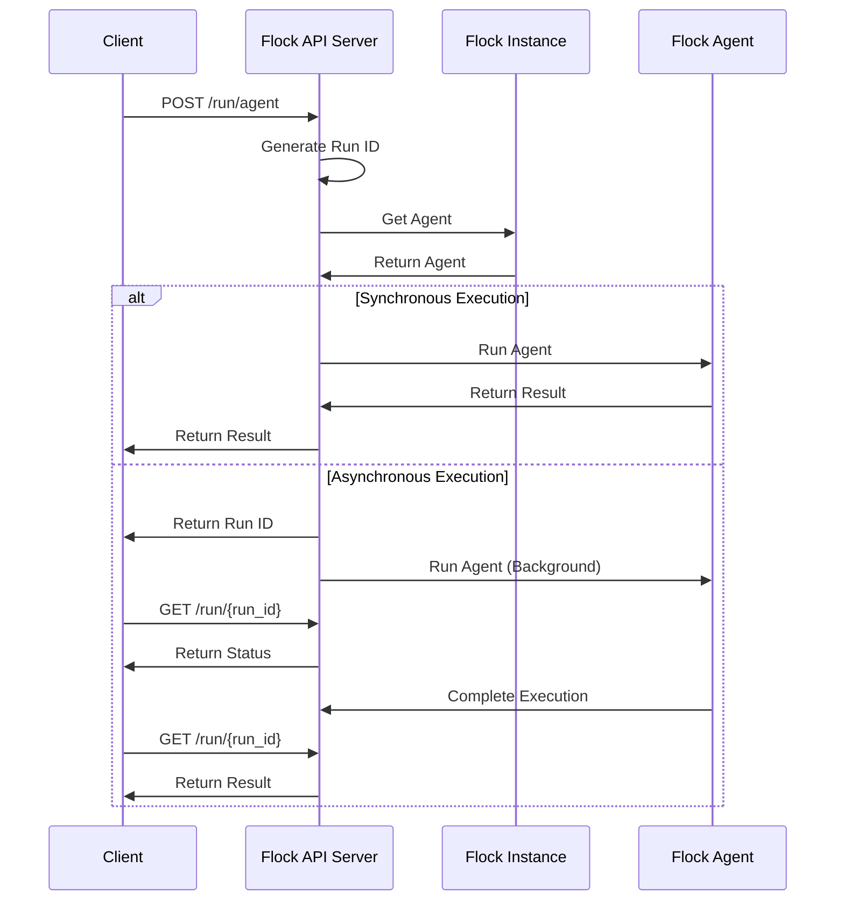

# REST API Server

Flock provides a built-in REST API server that allows you to expose your agents via HTTP endpoints. This makes it easy to integrate Flock agents into web applications, microservices, or any system that can make HTTP requests.



## Setting Up the API Server

To set up the API server, you need to create a `FlockAPI` instance and pass your Flock instance to it:

```python
from flock.core import Flock, FlockAgent
from flock.core.flock_api import FlockAPI

# Create a Flock instance
flock = Flock(model="openai/gpt-4o")

# Create and add an agent
agent = FlockAgent(
    name="my_agent",
    input="query: str | The query to process",
    output="result: str | The processed result"
)
flock.add_agent(agent)

# Create the API server
api = FlockAPI(flock)

# Start the server
api.start(host="0.0.0.0", port=8344)
```

This will start a FastAPI server on port 8344 that exposes your Flock agents via HTTP endpoints.

## API Endpoints

The API server provides the following endpoints:

### Run an Agent

```
POST /run/agent
```

This endpoint runs a specific agent with the provided inputs.

Request body:
```json
{
  "agent_name": "my_agent",
  "inputs": {
    "query": "Hello, world!"
  },
  "async_run": false
}
```

Response:
```json
{
  "run_id": "123e4567-e89b-12d3-a456-426614174000",
  "status": "completed",
  "result": {
    "result": "Processed: Hello, world!"
  },
  "started_at": "2025-02-25T01:23:45.678Z",
  "completed_at": "2025-02-25T01:23:46.789Z",
  "error": null
}
```

### Run a Flock Workflow

```
POST /run/flock
```

This endpoint runs a Flock workflow starting with the specified agent.

Request body:
```json
{
  "agent_name": "start_agent",
  "inputs": {
    "query": "Hello, world!"
  },
  "async_run": false
}
```

Response:
```json
{
  "run_id": "123e4567-e89b-12d3-a456-426614174000",
  "status": "completed",
  "result": {
    "result": "Processed: Hello, world!"
  },
  "started_at": "2025-02-25T01:23:45.678Z",
  "completed_at": "2025-02-25T01:23:46.789Z",
  "error": null
}
```

### Get Run Status

```
GET /run/{run_id}
```

This endpoint gets the status of a run.

Response:
```json
{
  "run_id": "123e4567-e89b-12d3-a456-426614174000",
  "status": "running",
  "result": null,
  "started_at": "2025-02-25T01:23:45.678Z",
  "completed_at": null,
  "error": null
}
```

### List Agents

```
GET /agents
```

This endpoint lists all available agents.

Response:
```json
{
  "agents": [
    {
      "name": "my_agent",
      "description": "An agent that processes queries",
      "input_schema": "query: str | The query to process",
      "output_schema": "result: str | The processed result",
      "hand_off": null
    }
  ]
}
```

## Synchronous vs. Asynchronous Execution

The API server supports both synchronous and asynchronous execution modes:

### Synchronous Execution

In synchronous mode, the API server waits for the agent to complete execution before returning a response. This is useful for quick operations that don't take too long to complete.

```json
{
  "agent_name": "my_agent",
  "inputs": {
    "query": "Hello, world!"
  },
  "async_run": false
}
```

### Asynchronous Execution

In asynchronous mode, the API server returns immediately with a run ID, and the agent execution continues in the background. The client can then poll the `/run/{run_id}` endpoint to check the status of the run.

```json
{
  "agent_name": "my_agent",
  "inputs": {
    "query": "Hello, world!"
  },
  "async_run": true
}
```

## Error Handling

If an error occurs during agent execution, the API server will return an error response:

```json
{
  "run_id": "123e4567-e89b-12d3-a456-426614174000",
  "status": "failed",
  "result": null,
  "started_at": "2025-02-25T01:23:45.678Z",
  "completed_at": "2025-02-25T01:23:46.789Z",
  "error": "Agent 'unknown_agent' not found"
}
```

## Client Integration

You can integrate the API server with any client that can make HTTP requests. Here's an example using Python's `requests` library:

```python
import requests
import time

# Run an agent synchronously
response = requests.post(
    "http://localhost:8344/run/agent",
    json={
        "agent_name": "my_agent",
        "inputs": {
            "query": "Hello, world!"
        },
        "async_run": False
    }
)
result = response.json()
print(f"Result: {result['result']}")

# Run an agent asynchronously
response = requests.post(
    "http://localhost:8344/run/agent",
    json={
        "agent_name": "my_agent",
        "inputs": {
            "query": "Hello, world!"
        },
        "async_run": True
    }
)
run_id = response.json()["run_id"]

# Poll for the result
while True:
    response = requests.get(f"http://localhost:8344/run/{run_id}")
    status = response.json()
    if status["status"] in ["completed", "failed"]:
        break
    time.sleep(1)

if status["status"] == "completed":
    print(f"Result: {status['result']}")
else:
    print(f"Error: {status['error']}")
```

## Security Considerations

The API server does not include authentication or authorization mechanisms by default. If you're exposing the API server to the internet or a shared network, you should consider adding security measures such as:

- API keys or tokens
- OAuth2 authentication
- Rate limiting
- HTTPS encryption

You can implement these security measures using FastAPI middleware or by placing the API server behind a reverse proxy like Nginx or Traefik.

## Performance Considerations

For production deployments, consider the following performance optimizations:

- Use asynchronous execution for long-running operations
- Implement caching for frequently used results
- Scale horizontally by deploying multiple API servers behind a load balancer
- Use a production-grade ASGI server like Uvicorn with Gunicorn

## Next Steps

Now that you understand the REST API server, you might want to explore:

- [Agents](../core-concepts/agents.md) - Learn more about Flock agents
- [Workflows](../core-concepts/workflows.md) - Understand how workflows work in Flock
- [Temporal Integration](temporal.md) - Learn about Temporal integration
- [Production Setup](../deployment/production-setup.md) - Set up Flock for production
