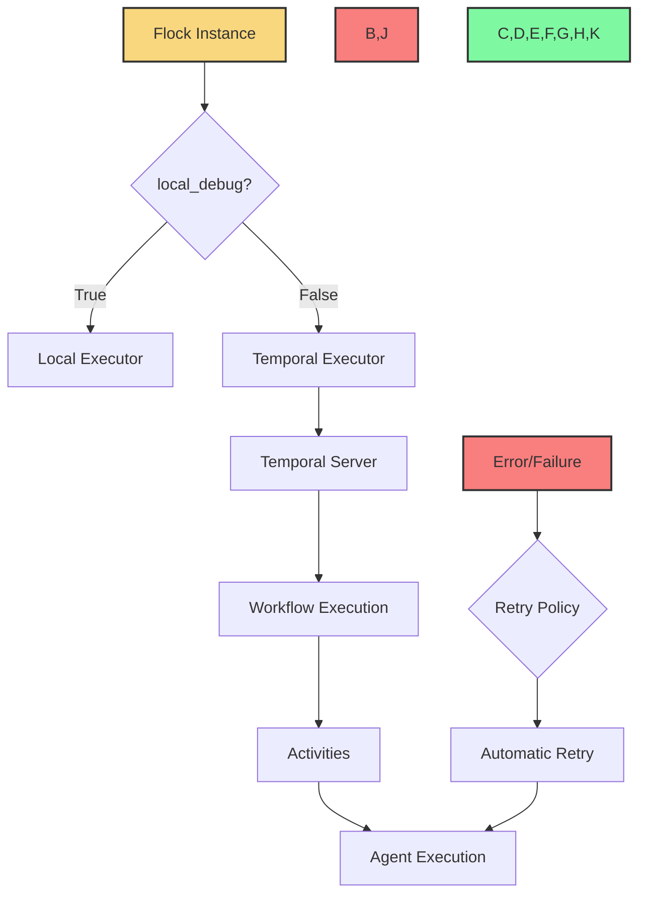

# Temporal Integration

Flock integrates with [Temporal](https://temporal.io/) to provide production-grade workflow execution for agent systems. This integration enables fault-tolerant, scalable, and observable agent workflows that can run reliably in production environments.



## What is Temporal?

Temporal is a workflow orchestration platform that ensures the successful execution of code that implements business logic. It provides:

- **Durability**: Workflows continue executing even if the process or machine fails
- **Reliability**: Automatic retries and error handling
- **Visibility**: Monitoring and debugging tools
- **Scalability**: Distributed execution across multiple machines

## Why Temporal for Agent Systems?

Agent systems face unique challenges that make Temporal an ideal fit:

1. **Long-Running Processes**: Agent workflows can run for minutes, hours, or even days
2. **Complex Orchestration**: Agents often need to coordinate with each other and external systems
3. **Error Recovery**: Agent operations can fail for various reasons (API limits, network issues, etc.)
4. **State Management**: Maintaining state across agent executions is critical
5. **Observability**: Understanding what agents are doing and why is essential for debugging

Temporal addresses these challenges by providing:

- **Durable Execution**: Workflows continue even if processes crash
- **Automatic Retries**: Failed activities are automatically retried based on configurable policies
- **Workflow History**: Complete history of workflow execution for debugging
- **Distributed Execution**: Scale agent workflows across multiple machines
- **Visibility Tools**: Monitor and debug agent workflows in real-time

## Current Integration

Flock currently provides basic Temporal integration through the `TemporalExecutor` class. This integration allows you to run agent workflows as Temporal workflows, providing durability and automatic retries.

To enable Temporal integration, set `local_debug=False` when creating a Flock instance:

```python
from flock.core import Flock
from flock.core.execution.temporal_executor import TemporalExecutorConfig

# Create a Flock instance with Temporal enabled
flock = Flock(
    model="openai/gpt-4o",
    local_debug=False,  # Enable Temporal
    temporal_executor_config=TemporalExecutorConfig(
        retry_attempts=3,  # Retry failed activities 3 times
        retry_interval=5,  # Wait 5 seconds between retries
    )
)
```

## Temporal Executor Configuration

The `TemporalExecutorConfig` class allows you to configure the Temporal executor:

```python
from flock.core.execution.temporal_executor import TemporalExecutorConfig

config = TemporalExecutorConfig(
    retry_attempts=3,           # Maximum number of retry attempts
    retry_interval=5,           # Initial interval between retries (seconds)
    retry_max_interval=60,      # Maximum interval between retries (seconds)
    retry_coefficient=2.0,      # Coefficient to multiply the interval by after each retry
    task_queue="flock-queue",   # Temporal task queue name
    namespace="default",        # Temporal namespace
    server_url="localhost:7233" # Temporal server URL
)
```

## Future Roadmap: First-Class Temporal Support

We are currently hard at work to offer first-class Temporal support to deploy agents the "Temporal way." This enhanced integration will provide:

### 1. Native Temporal Workflows

Agents will be deployable as native Temporal workflows, allowing for:

- **Seamless Integration**: Deploy agents directly to Temporal without additional configuration
- **Workflow Versioning**: Update agent workflows without affecting running instances
- **Workflow Signaling**: Send signals to running agent workflows to modify their behavior
- **Child Workflows**: Create hierarchical agent workflows for complex tasks

### 2. Advanced Retry Policies

More sophisticated retry policies for different types of failures:

- **API Rate Limiting**: Exponential backoff for rate limit errors
- **Transient Errors**: Quick retries for temporary failures
- **Permanent Errors**: No retries for unrecoverable errors

### 3. Temporal-Aware Agents

Agents that are aware of Temporal capabilities:

- **Checkpointing**: Save progress at critical points
- **Continuations**: Resume execution from saved checkpoints
- **Timeouts**: Configure timeouts for different operations
- **Heartbeating**: Report progress for long-running activities

### 4. Deployment Tools

Tools for deploying and managing agent workflows in Temporal:

- **CLI Commands**: Deploy, update, and monitor agent workflows
- **Deployment Templates**: Pre-configured deployment options for common scenarios
- **Monitoring Dashboards**: Custom dashboards for agent workflows

### 5. Multi-Agent Orchestration

Advanced orchestration for multi-agent systems:

- **Agent Pools**: Deploy pools of agents for parallel processing
- **Dynamic Scaling**: Scale agent pools based on workload
- **Resource Allocation**: Allocate resources to agents based on priority
- **Cross-Agent Communication**: Facilitate communication between agents

## Setting Up Temporal

To use Temporal with Flock, you need to set up a Temporal server. Here are the basic steps:

### Using Docker

The easiest way to run Temporal locally is using Docker:

```bash
docker run --rm -p 7233:7233 -p 8233:8233 temporalio/temporal:latest
```

This starts a Temporal server on port 7233 (gRPC) and 8233 (HTTP).

### Using Temporal Cloud

For production deployments, you can use [Temporal Cloud](https://temporal.io/cloud):

1. Sign up for Temporal Cloud
2. Create a namespace
3. Configure Flock to use your Temporal Cloud namespace:

```python
flock = Flock(
    model="openai/gpt-4o",
    local_debug=False,
    temporal_executor_config=TemporalExecutorConfig(
        namespace="your-namespace",
        server_url="your-namespace.tmprl.cloud:7233",
        tls_cert_path="/path/to/cert.pem",
        tls_key_path="/path/to/key.pem",
    )
)
```

## Example: Fault-Tolerant Agent Workflow

Here's an example of a fault-tolerant agent workflow using Temporal:

```python
from flock.core import Flock, FlockAgent
from flock.core.execution.temporal_executor import TemporalExecutorConfig

# Create a Flock instance with Temporal enabled
flock = Flock(
    model="openai/gpt-4o",
    local_debug=False,
    temporal_executor_config=TemporalExecutorConfig(
        retry_attempts=3,
        retry_interval=5,
    )
)

# Create agents
research_agent = FlockAgent(
    name="research_agent",
    input="topic: str | The topic to research",
    output="findings: str | Research findings"
)

summarize_agent = FlockAgent(
    name="summarize_agent",
    input="findings: str | Research findings",
    output="summary: str | Concise summary"
)

# Chain agents
research_agent.hand_off = summarize_agent

# Add agents to the flock
flock.add_agent(research_agent)
flock.add_agent(summarize_agent)

# Run the workflow
result = flock.run(
    start_agent=research_agent,
    input={"topic": "Temporal workflows"}
)

print(result)
```

In this example, if either the research agent or the summarize agent fails, Temporal will automatically retry the failed activity according to the configured retry policy.

## Best Practices

When using Temporal with Flock, consider the following best practices:

1. **Configure Appropriate Retry Policies**: Different operations may need different retry policies
2. **Use Timeouts**: Set appropriate timeouts for activities to prevent indefinite hanging
3. **Monitor Workflow Execution**: Use Temporal's UI to monitor and debug workflows
4. **Handle Non-Retryable Errors**: Some errors should not be retried (e.g., invalid input)
5. **Test Failure Scenarios**: Test how your workflows behave when failures occur

## Next Steps

Now that you understand Temporal integration, you might want to explore:

- [Workflows](../core-concepts/workflows.md) - Learn more about Flock workflows
- [Error Handling](../core-concepts/error-handling.md) - Understand error handling in Flock
- [Production Setup](../deployment/production-setup.md) - Set up Flock for production
- [Temporal Documentation](https://docs.temporal.io/) - Learn more about Temporal
